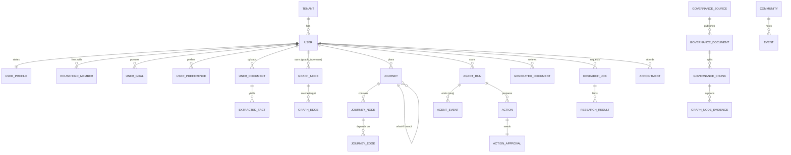
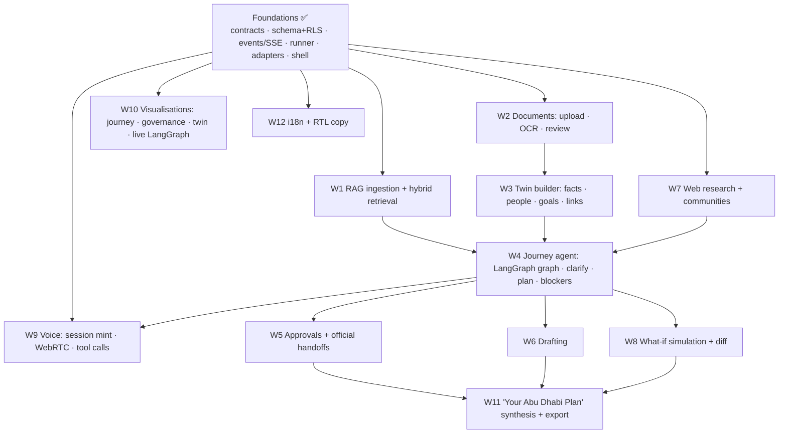

# ADAPT architecture

**ADAPT — Abu Dhabi Digital Arrival & Planning Twin.** This document is the reference for
everyone building on the shared foundations: what exists, why it is shaped this way, and
the contracts each workstream builds against.

Status (2026-09-29): **domain model implemented.** The backend serves the full product API
under `/api` (the spec endpoint list, §3) on the domain schema of migration `0002` and later
revisions. Seed data includes the governance knowledge graph, the Discover catalogue and a
complete fictional demo household. The backend-owned suites (user and graph isolation, RAG
retrieval, journeys, approval states, document lifecycle, event streaming over JSON/SSE/
WebSocket, security) pass against real Postgres. Feature workstreams own their packages and
docs: knowledge ([docs/knowledge-layer.md](docs/knowledge-layer.md)), research
([docs/research.md](docs/research.md)), documents and personalization
([docs/private-user-twin.md](docs/private-user-twin.md)), the journey agent
([docs/journey-agent.md](docs/journey-agent.md)) and voice ([docs/voice.md](docs/voice.md)).
The backend design reference is [docs/backend.md](docs/backend.md).

---

## Contents

0. [Key decisions](#0-key-decisions)
1. [Repository structure](#1-repository-structure)
2. [Domain model](#2-domain-model)
3. [API](#3-api)
4. [Event model: streaming agent progress](#4-event-model-streaming-agent-progress)
5. [Graph schema](#5-graph-schema)
6. [RAG schema](#6-rag-schema)
7. [LangGraph state and execution](#7-langgraph-state-and-execution)
8. [Adapter interfaces (actions and third parties)](#8-adapter-interfaces)
9. [Frontend and PWA architecture](#9-frontend-and-pwa-architecture)
10. [Implementation dependency map](#10-implementation-dependency-map)
11. [Security and privacy](#11-security-and-privacy)
12. [Configuration and demo mode](#12-configuration-and-demo-mode)
13. [Testing](#13-testing)
14. [Open questions and known limits](#14-open-questions-and-known-limits)

---

## 0. Key decisions

| # | Decision | Why |
|---|----------|-----|
| D1 | **Both knowledge graphs live in PostgreSQL**, in one pair of typed tables (`graph_nodes`, `graph_edges`) with a `graph_type` column (`governance` / `user`). No Neo4j. User-graph rows always carry `user_id`; governance rows are shared. | One transactional store with pgvector. Graph traversals here are shallow (dependency chains of about 10 hops), which recursive CTEs handle well. Cross-graph personalisation edges ("my goal PURSUES this service") are ordinary rows. |
| D2 | **Privacy is enforced by the database, not only by code.** Private rows are protected by Postgres row-level security keyed on transaction-local `app.user_id` / `app.tenant_id`. The runtime role is neither superuser nor owner, so RLS always applies. | "Never returned across users" must survive a buggy query. Tests prove it: an unfiltered `SELECT` from another user returns 0 rows. |
| D3 | **Honesty rules live in three layers**: Pydantic validators, then adapter types, then CHECK constraints and a trigger. | A fabricated submission or booking is impossible to *represent*: it's rejected at construction and again at insert. |
| D4 | **Pydantic models are the single source of truth for API contracts.** OpenAPI is exported and TypeScript is generated into `packages/contracts`. A backend test fails if the committed contract is stale. | Frontend and backend workstreams can't drift. The SSE event union is exported too, even though it isn't a normal route body. |
| D5 | **The agent event log is Postgres (`agent_events`); Redis pub/sub is only a wake-up signal.** SSE and WebSocket streams replay from Postgres using `Last-Event-ID` / `?after=`. | No lost events on reconnects or Redis blips. The log is also an audit trail. |
| D6 | **Every third-party capability sits behind an interface with a deterministic demo adapter**, chosen per capability (`auto` / `live` / `demo`). Demo adapters *refuse* rather than invent: the demo LLM raises if no deterministic responder is registered, and the demo web researcher reports "unavailable" with no fabricated sources. | The app runs without keys, and demo mode never produces fake facts. |
| D7 | **Government actions are official handoffs** unless a real, authenticated integration exists. ADAPT never collects UAE PASS credentials. | ADAPT has no government API access. Handoff means ADAPT prepares everything and the user completes the step on the official channel. |
| D8 | **Cookie sessions (httpOnly, SameSite=Lax, path `/api`), same-origin API.** nginx (prod) and Vite (dev) proxy `/api`. Identity providers sit behind `app.core.auth` (`IdentityProvider` → `sign_in` → `Principal`); only the demo provider ships. | No tokens reachable by JavaScript or localStorage. Native `EventSource` and WebSocket handshakes work with cookies. |
| D9 | **LangGraph runtime context carries live dependencies; graph state stays JSON-only.** Authorisation comes from context, never from state. | Checkpoints stay serialisable and small, and can't be used to escalate access. |
| D10 | Frontend: React 19, React Router 8 (data router, lazy routes), TanStack Query 5 (server state, in-memory only), Zustand 5 (UI state; only the theme is persisted), Tailwind 4 (CSS-first tokens), `motion` (Framer Motion), `@xyflow/react` (React Flow) for the journey, knowledge and agent graphs, `radix-ui` primitives (tabs, switch, slider, tooltip, toggle group), Lucide icons, vite-plugin-pwa (generateSW). | These match the specified stack at current major versions. |
| D11 | **Research (W7) is asynchronous and self-contained** (`backend/app/research/`, design in [docs/research.md](docs/research.md)). An ARQ job runs one LangGraph node per category in parallel. Search is live OpenAI web search (agentic for open-ended categories) or, without a key, a curated URL-verified snapshot. Results carry a trust tier (Law / Official guidance / Community information / ADAPT suggestion) and a source label (Official / Organization / Community / General web); no numeric score is exposed. | Nothing waits for research. The honesty rules (grounded URLs only, law only from official domains, contacts only if found on the cited page, no faith inference) are enforced in code and by DB CHECKs. |
| D12 | **Governance knowledge follows one rule: no citation, no fact** (`backend/app/knowledge/`; design in [docs/knowledge-layer.md](docs/knowledge-layer.md)). A curated corpus of 60 official pages (317 passages, researched live 2026-09-29) is the offline seed. Every governance node and relationship cites a passage; the seed loader and tests reject anything uncited. Sources rank TAMM/Abu Dhabi Government > u.ae > ADGM > health authority > ICP/federal > other official, and trust is re-derived from the URL on every read. Retrieval is BM25 (corpus IDF) fused with pgvector. `POST /knowledge/explain` evaluates facts against the graph with three-valued checks (a missing fact is *unknown*, never *unmet*) and returns fact → requirement → evidence → task highlight links. | Government requirements must be traceable to an official page, and a plausible but unsourced relationship is worse than a missing one. Research showed that several "obvious" edges were wrong or unsupported: Tawtheeq for the family visa, trade name before initial approval, Emirates ID before residence. |
| D13 | **The private user twin is facts with provenance, kept apart from governance knowledge** (`backend/app/personalization/`, `backend/app/documents/`; design in [docs/private-user-twin.md](docs/private-user-twin.md)). User-graph nodes carry no properties (DB CHECK); every personal detail is an `extracted_facts` row with value, confidence, source, source document and extraction method, in a closed per-entity vocabulary. Entities exist while facts support them. Documents run classify → OCR/VLM → validate (incl. passport MRZ check digits) → structure; below 0.85 confidence, or on any conflict, a fact waits in a review task. Readers sit behind a provider-neutral port: local PDF text layer first, OpenAI vision when a key exists, and no canned "demo" readings. Planning keys carry `fact_ids`, so any recommendation can show which of the person's details it used. | Public rules must never masquerade as personal facts, and personal facts must never be invented or silently overwritten. Provenance per fact makes review, correction, deletion and explanation exact. |
| D14 | **The API follows the product spec: base path `/api`** (no version segment) with the spec's resource names (`/onboarding/profile`, `/graph/{governance,user,journey/{id}}`, `/agents/{run_id}/…`, `/documents/generated`). Core routes live in `app/api/routes`; feature routers mount when their package imports and replace the core fallback for shared paths. | One contract for every workstream. A feature package that fails to import is logged and skipped, so it can't take the API down. |
| D15 | **Agent events are flat JSON discriminated by `event`** (`{"event":"node_started","run_id":…,"seq":3,"node":"document_analysis","label":"Analyzing your documents"}`), served as JSON replay, SSE (`Accept: text/event-stream`) and WebSocket (`/agents/{id}/stream`). | The spec's example format. One validated union (`AgentEvent`) serves every transport and is exported to TypeScript. |
| D16 | **Profile tables are the canonical store of what the user states; the user graph is the integrated view.** Onboarding writes `user_profiles` / `household_members` / `user_goals` / `user_preferences` and projects them into the user graph in the same transaction (through the personalization package when installed). Document-derived facts live in `extracted_facts` with per-fact provenance. | One writer per fact means no drift; every fact on the graph says where it came from. |
| D17 | **Migration `0002` rebuilt the provisional foundation tables rather than renaming them in place.** It dropped the demo-only private rows and both graphs, kept accounts, and re-seeded. `0001` keeps frozen copies of its SQL, so `0002`'s downgrade restores it exactly. | The spec renamed almost every column and table. A clean rebuild with a tested downgrade was safer than dozens of renames with stale constraint and policy names. |
| D18 | **Accounts are RLS-protected too.** A new account claims its random ids as the transaction principal before inserting. Identity-provider lookup goes through one narrow SECURITY DEFINER function. | The runtime role can't enumerate users, even through a buggy query. |
| D19 | **The journey agent is a persisted, resumable LangGraph pipeline whose plans come only from the cited governance graph** (`backend/app/agents/journey/`; design in [docs/journey-agent.md](docs/journey-agent.md)). Twelve nodes run in a fixed order, each with typed input/output TypedDicts that are enforced at runtime: a node sees only the keys it declares and can't write any other key. Planning, dependency analysis, eligibility and risk detection are deterministic; the LLM only parses the request and drafts letters. Three human gates are `interrupt()`s (action approval, low-confidence document correction, submission confirmation) resumed through `agent_runs.pending_review` with an atomic claim. What-ifs deep-copy the base checkpoint into a new thread, use read-only services, and re-run only nodes whose declared facts or inputs changed. | "Don't hallucinate a government obligation" is guaranteed by construction, not by prompting. Typed node contracts make "never silently mutates unrelated data" testable. Declared dependencies make what-if re-execution minimal and explainable, and the base journey provably untouched. |
| D20 | **Actions: nothing is submitted or completed because a mock ran.** Types `government_portal`, `appointment`, `document_submission`, `official_handoff`; statuses `draft → prepared → awaiting_approval → approved → handoff_required → submitted → completed` (+ `blocked`, `failed`; rejected goes back to `draft`). Real adapters are official handoffs; demo adapters add deterministic previews labelled `DEMO / SIMULATED`. Only the person's own confirmation (`confirmation_source = user_reported`) or a real external reference moves an action past `handoff_required`. `ADAPTER_ACTIONS=auto` means demo previews outside production. | ADAPT has no authenticated government integration. The honesty rules live in `app/domain/actions.py` (state machine, grants bound to one action) and again in DB CHECKs and a trigger. |
| D21 | **The frontend depends on its own domain model, behind a per-capability service layer** (`frontend/src/domain`, `frontend/src/services`). Each capability (session, graphs, runs, profile, journeys, documents, generated, approvals, discover, simulate, assistant, voice) resolves to `live` (feature flag on in `/system/info` and a live adapter exists), `mock` (typed in-memory implementation) or `unavailable`, according to `VITE_DATA_MODE` = `live` \| `auto` \| `mock`. Live adapters in `services/live/*` are the only code that knows the wire format; each workstream owns its adapter file. | The API changed shape while the UI was being built (paths, event format, vocabulary). Only adapters move when it does. `auto` lets every screen work before its endpoint ships; `mock` runs the whole product with no backend; `live` never shows mock data, for real deployments. |
| D22 | **The backend owns all journey state; the browser follows the agent event log.** Runs are listed by the server (`GET /agents/runs`, any device), and a live change feed (`services/live/activity.ts`) reads that list and each run's new events with `?after=<seq>` cursors, turning them into cache-invalidation topics (`TOPIC_KEYS`), so screens refetch from the API. It starts once a session exists. The SSE console (`/agents?run=`) is unchanged. The frontend keeps only ids it needs to send back (e.g. which uploads belong to the plan being started). | One source of truth: a reload, a second device, voice or the journey agent itself (queueing research) all show up without client bookkeeping. Per-run cursors on the durable log never lose an event. Polling one list avoids exhausting the browser's six connections with an SSE stream per run. |
| D23 | **Human gates report their live state, and every gate that opens is closed on the stream.** `GET /agents/{run}/review` adds each action item's current `approval_status` / `decided_at` from the approval rows. Document-correction and submission-confirmation answers emit `approval_resolved` under the review id. Decisions on one review recount open approvals after their own commit, so concurrent last decisions resume the run exactly once. Only a paused run can be cancelled (`POST /agents/{run}/cancel`): its open approvals expire and their actions return to draft. | A stored interrupt payload is what was asked, not what was decided, and stale "pending" cards invited double approvals (409). Under READ COMMITTED, two concurrent last approvals each saw the other pending and the run never resumed (now tested with a barrier). Cancelling a running run would race the worker, so it isn't offered. |
| D24 | **The UI's vocabulary is translated at the live adapter, including what-ifs.** What if? edits onboarding-style answers (`ASSUMPTION.*`); `liveSimulate` maps them to the planner's scenario variables (`household.move_with_spouse`, `household.children_count`, `household.planned_arrival_date`, `company.jurisdiction`), reports which ones the backend can simulate (`/what-if/variables`), and the panel offers only those. `toJourney` derives the same answers from the planner's facts. | The page was built on the mock planner's keys; against the API most changes were rejected and the starting values were wrong. The adapter stays the only code that knows the wire format (D21). |
| D25 | **Demo scenarios are scripted inputs to the real pipeline, never canned outputs** (`app/demo_scenarios/`, design and runbook in [docs/demo-founder-arrival.md](docs/demo-founder-arrival.md)). A scenario kit (`GET /api/demo/scenarios/{key}` plus its synthetic PDFs) exists only where demo sign-in is enabled. The presenter page `/demo/founder-arrival` and `scripts/demo_founder_arrival.py` post its fixed bodies verbatim to the public routes (onboarding, uploads, document review, journey, research, what-if) and read everything back through the normal services. | A hackathon demo must look the same every run without faking anything: real reading, real planning, real research labels. One script serves the page and the rehearsal, so they can't drift. |
| D26 | **Repeatable runs are a request option, not a mode.** `POST /journey {deterministic: true}` gives that run (and its what-ifs) the rule-based intake parser and drafting templates even when an LLM key is set, and asks research for the curated snapshot. `POST /research {mode: "snapshot"}` pins the engine for a job, and the worker honours it. A journey starts at most one research job (`PlatformResearch` reuses the one already started for it). | Determinism stays opt-in and scoped to a run: live users keep live models and live web search. Reusing the research job means approving actions later doesn't start a second, possibly different, research run. |
| D27 | **"Things you may not have considered" are cited rules over the saved plan, kept apart from risks** (`app/agents/journey/considerations.py`, stored in `journeys.considerations`, typed as `ConsiderationOut`). Each rule reads tasks, requirements, facts and the plan's own evidence records, and is dropped when it has no official citation. Two ship: the attestation chain starts where a certificate was issued, and a spouse's visa waits on a registered lease that itself waits on the sponsor's residence. | A consideration isn't something wrong (a risk) or something to do (a step); it's a consequence across areas the planner can't draw as an edge without inventing one. The live UI previously had no source for this section. |
| D28 | **Research results say how they were retrieved** (`ResearchResultOut.retrieval {method, label, note, retrieved_at}`), derived at read time from the job's engine, so no migration is needed. Snapshot results read "ADAPT reviewed source list: a person checked this page on {date}. Not a live web search." | Retrieval metadata has to be visible per result, not only per job, so a demo or a screenshot never passes a curated list off as live search. |

---

## 1. Repository structure

```
ADAPT/
├── ARCHITECTURE.md                 this document
├── README.md                       setup and daily commands
├── docker-compose.yml              postgres · redis · migrate · backend · worker · frontend
├── .env.example                    every setting, with working defaults
├── package.json                    npm workspaces: packages/*, frontend
├── infra/postgres/init/01-roles.sh runtime role (RLS-bound), test database, extensions
│
├── packages/contracts/             @adapt/contracts: shared TypeScript API contracts
│   ├── openapi.json                exported from the backend (committed)
│   └── src/
│       ├── generated/openapi.ts    GENERATED: never edit
│       └── index.ts                ergonomic aliases, event guards, ApiResponse<> helper
│
├── backend/                        Python 3.13 · FastAPI · SQLAlchemy 2 (async, psycopg 3) · uv
│   ├── Dockerfile                  one image for api, worker and migrate
│   ├── alembic.ini, migrations/    0001 = full schema + RLS policies + trigger + grants
│   ├── scripts/export_openapi.py   OpenAPI → packages/contracts (no services needed)
│   ├── app/
│   │   ├── main.py                 app factory, middleware, OpenAPI incl. extra contracts
│   │   ├── core/                   config · errors (RFC 9457) · security · logging · middleware · container · compat
│   │   ├── domain/                 PURE: enums · provenance/trust rules · twin facts · graph rules · action invariants · principal
│   │   ├── contracts/              API DTOs (Pydantic) → TypeScript. Includes the AgentEvent union
│   │   ├── db/                     Base, session (RLS context), rls.py (policy SQL builders), models/
│   │   ├── repositories/           queries: accounts · graph (governance and twin) · runs
│   │   ├── services/               use cases (runs) + presenters (ORM → contract)
│   │   ├── api/routes/             core routers (system · auth · profile · graph · agents · generated docs · catalogue · appointments); router.py mounts feature routers
│   │   ├── events/                 emitter (persist + seq) · notifier (Redis) · stream (SSE)
│   │   ├── agents/                 context · instrumentation · runner · checkpointer · diagnostic graph
│   │   │   └── journey/            state.py (JourneyState) · topology.py (canonical node/edge list)
│   │   ├── adapters/               llm · embeddings · ocr · voice · web_search · actions · storage · registry
│   │   ├── workers/                ARQ settings · tasks · queue · deps · __main__ (Windows-safe runner)
│   │   └── seed/                   governance.yaml (demo governance graph) + idempotent loader
│   └── tests/{unit,integration}/
│
└── frontend/                       React 19 · Vite 8 · TypeScript · Tailwind 4 · PWA
    ├── Dockerfile, nginx.conf      static build (VITE_API_BASE_URL, VITE_DATA_MODE) + /api proxy (SSE/WS-safe) + CSP
    ├── vite.config.ts              PWA manifest + shell-only service worker, dev proxy, vitest
    ├── pwa-assets.config.ts        icons + iOS splash screens from public/brand-mark.svg
    ├── public/                     generated icons and apple-splash-*.png, theme-init.js
    └── src/
        ├── main.tsx                Providers → Bootstrap (resolve services, open session) → RouterProvider
        ├── domain/                 frontend domain model: journey graph, documents, approvals, discover, runs/events, graph, profile, simulate, assistant
        ├── services/
        │   ├── types.ts            service interfaces (the UI's only data contract)
        │   ├── registry.ts         live | mock | unavailable per capability (VITE_DATA_MODE + /system/info features)
        │   ├── context.tsx         ServicesProvider (+ change-driven cache invalidation), useServices, currentServices
        │   ├── live/               adapters: foundation (session, graphs, runs/SSE), events (wire → RunEvent), governanceFormat,
        │   │                       profile (onboarding), generated (drafts), documents + userGraph (W2/W3), research (W7),
        │   │                       journeys (W4/W5/W8: journeys, approvals, reviews, simulation): one owner per file
        │   └── mock/               in-memory backend: planner (profile → journey graph), runEngine + journeyRun (scripted
        │                           agent runs), store (tab-scoped), content, twin, assistant, fixtures/governance.json
        ├── app/                    router (all routes, legacy redirects) · RootRedirect · SessionGate/Bootstrap · RouteError
        │   └── layout/             AppShell (default | wide | full layouts) · Sidebar · MobileNav (top bar, bottom nav) ·
        │                           AssistantDock (FAB, docked panel on desktop, sheet on phones) · SystemNotices (offline,
        │                           update, Life Brief toast, dev badge)
        ├── components/
        │   ├── ui/                 design system primitives (Button, Card, Badge, TrustBadge, StatusBadge, SourceLink, Field,
        │   │                       Controls (Radix), Progress, States, Sheet, Toast, AreaLabel…)
        │   ├── journey/            NodeActionButton, JourneyLines (compact transit map), BuildingPlanCard
        │   └── approvals/          ApprovalCard
        ├── lib/                    api (client, errors, hooks, queryKeys) · events (run reducer, useRunEvents) ·
        │                           journey (analysis, diff) · format · languages (Intl.DisplayNames) · hooks
        ├── stores/ui.ts            Zustand: assistant panel, theme (the only persisted state)
        ├── styles/index.css        design tokens (light/dark), lane colours, React Flow theme, sheet styles
        └── features/               onboarding · home · journey · knowledge · agents · documents · discover · simulate ·
                                    assistant · profile · settings · voice (W9, owned by the voice workstream)
```

**Layering rules**

* `domain/` imports nothing from the app. `contracts/` may import `domain/` (enums, value objects).
* Routers stay thin: parse, authorise, then call a service or repository, then present.
* Only `adapters/` import third-party SDKs (`openai`). Agents and services depend on the interfaces.
* UI components never call `fetch` or services. They use `lib/api/hooks.ts` (TanStack Query), which calls the resolved
  services (`services/context`), whose live adapters use `lib/api/client.ts`. UI code imports `src/domain` types, never
  `@adapt/contracts`; only `services/live/*` does.

---

## 2. Domain model

Full entity list, invariants, storage and API ownership: [docs/backend.md](docs/backend.md).



Shared reference data: `governance_*`, governance graph rows, `communities`, `events`,
`cultural_guides`. Everything else is private and owner-only under RLS.

### Core concepts (`backend/app/domain`)

| Concept | Where | Rule |
|---|---|---|
| **Two graphs** | `GraphType = governance \| user` | Governance is shared public knowledge. The user graph (the digital twin) is one user's private situation. |
| **Trust tier** | `EvidenceKind` + `Provenance` | `authoritative_requirement`, `official_guidance`, `community_web`, `ai_recommendation`. The two official tiers **must cite an official domain** (`is_official_source`: https + suffix in `OFFICIAL_DOMAIN_SUFFIXES`, which lives in code on purpose). Web findings must cite a URL and record `retrieved_at`. |
| **Facts** | `TwinFact`, `extracted_facts` | Every personal fact records its source (`user_stated`, `document_extracted`, `inferred`, `system`), a source reference, confidence and confirmation. |
| **Sensitive attributes** | `SENSITIVE_ATTRIBUTES`, `faith_is_user_stated` CHECK | Faith, ethnicity, health and similar can **only be `user_stated`**. Faith also requires `faith_personalization = granted`, and withdrawing consent deletes it. Nothing is inferred from nationality, name or language. |
| **Principal** | `Principal(user_id, tenant_id)` | The only authority for private access. Jobs receive it as arguments and re-verify it through RLS. |
| **Action honesty** | `ActionStatus`, action CHECKs + trigger | `approved` / `submitted` / `completed` need an **approved** human decision on that action. `completed` needs an external reference. Simulated adapters can't submit. Handoffs need an https official URL. |
| **Run lifecycle** | `RunStatus` | `queued → running ⇄ awaiting_input → succeeded / failed / cancelled` |
| **Journey node** | `StepStatus`, `StepCategory`, `Blocker` | Stable `key`s, `journey_edges` for dependencies (same journey enforced by composite FKs), an optional governance node, a `Provenance`, blockers, and `basis` (the fact ids it relied on). |

---

## 3. API

Base path **`/api`**. JSON in and out. Errors are **RFC 9457 problem details**
(`application/problem+json`) with a stable `code` and a `request_id`. Every `/api` response
is `Cache-Control: no-store`. Auth is the session cookie (or `Authorization: Bearer` for
tools and tests). Long work returns **202 + `RunStarted {run, events_url, stream_url}`**.
All types are exported from `@adapt/contracts` (`npm run contracts:generate`).

| Area | Routes | Owner |
|---|---|---|
| System and auth | `GET /health` · `GET /health/ready` · `GET /system/info` · `POST /auth/demo-session` · `POST /auth/logout` · `GET/DELETE /me` · `PATCH /me/preferences` | backend |
| Profile | `POST /onboarding/profile` · `GET /profile` · `PATCH /profile` | backend |
| Documents | `POST /documents/upload` · `GET /documents` · `GET /documents/{id}` · `POST /documents/{id}/process` (+ review, signed content, delete) | documents |
| Generated documents | `GET /documents/generated` · `PATCH /documents/generated/{id}` (edit a draft, restore a discarded one) · `POST /documents/generated/{id}/approve` (+ read, discard) | backend |
| Graphs | `GET /graph/governance` (knowledge) · `GET /graph/user` (personalization) · `GET /graph/journey/{journey_id}` (backend) | as noted |
| Journeys | `POST /journey` · `GET /journey` · `GET /journey/{id}` · `GET /journey/{id}/what-if/variables` · `POST /journey/{id}/simulate` · `POST /journey/{id}/nodes/{key}/done` · `POST /journey/{id}/nodes/{key}/answer`; see [docs/journey-agent.md](docs/journey-agent.md) | journey agent |
| Agents | `GET /agents` · `POST /agents/run` · `GET /agents/runs` (your runs, `?active=`, `?kind=`, `?status=`) · `GET /agents/{run_id}` · `POST /agents/{run_id}/cancel` (paused runs only) · `GET /agents/{run_id}/events` (JSON or SSE) · `WS /agents/{run_id}/stream` · `GET /agents/journey/topology` | backend |
| Agent reviews | `GET /agents/{run_id}/review` · `POST /agents/{run_id}/resume` · `GET /agents/what_if/topology` | journey agent |
| Actions | `GET /actions` · `GET /actions/{id}` · `POST /actions/prepare` · `POST /actions/{id}/approve` · `POST /actions/{id}/reject` | journey agent |
| Research and Discover | `POST /research` · `GET /research/{job_id}` · `GET /discover` (+ save, add-to-journey, seen); see [docs/research.md](docs/research.md#api-under-api) | research |
| Catalogue | `GET /communities` · `GET /events` · `GET /cultural-guides` | backend |
| Appointments | `GET /appointments` · `POST /appointments/{id}/prepare` | backend |
| Voice | `POST /voice/session` · `POST /voice/tool-calls` · `POST /voice/assistant`; see [docs/voice.md](docs/voice.md) | voice |
| Demo scenarios (demo sign-in only) | `GET /demo/scenarios` · `GET /demo/scenarios/{key}` · `GET /demo/scenarios/{key}/documents/{doc}`; see [docs/demo-founder-arrival.md](docs/demo-founder-arrival.md) | backend |
| Knowledge | `GET /knowledge/search` · `POST /knowledge/retrieve` · `POST /knowledge/explain` | knowledge |

When a feature ships, its owner flips its flag in `SHIPPED_FEATURES`
(`app/api/routes/system.py`) so the UI enables the matching entry point.

---

## 4. Event model: streaming agent progress

Events are flat JSON objects discriminated by `event`, sharing the envelope `run_id`, `seq`
(gap-free, strictly increasing per run, starting at 1), `ts` and `node`:

```json
{"event": "node_started", "run_id": "…", "seq": 3, "ts": "…",
 "node": "document_analysis", "label": "Analyzing your documents"}
```

| Group | Events |
|---|---|
| lifecycle | `run_started {kind, agent}` · `run_status {status, reason}` · `run_completed {summary, journey_id}` · `run_failed {code, message, retryable}` · `run_cancelled {reason}` |
| nodes | `node_started {label, attempt}` · `node_progress {message, progress, detail}` · `node_completed {label, summary, duration_ms}` · `error {code, message, retryable}` |
| tools and evidence | `tool_called {tool, call_id, summary}` · `tool_result {tool, call_id, ok, summary}` · `evidence_found {title, source_url, authority, evidence_kind, chunk_id, quote, score}` |
| outputs and approvals | `document_generated {document_id, kind, title}` · `action_prepared {action_id, action_type, title, status, requires_approval}` · `approval_required {approval_id, action_id, title, summary, gate, item_count}` · `approval_resolved {approval_id, decision, gate}` · `question_asked` · `message_delta` · `artifact_created` / `artifact_updated` |
| research | `research_started` · `research_source_found` · `research_category_completed` · `research_completed` · `research_failed` |

Events carry **pointers, not private payloads**. Artifacts are fetched through their own
RLS-protected endpoints. Every `approval_required` is eventually matched by an
`approval_resolved` with the same `approval_id` (an action approval, or a review id for the
document-correction and submission-confirmation gates), or the run ends (D23). The browser
uses these events only as change signals and refetches state from the API (D22).

```mermaid
sequenceDiagram
    participant UI as Browser (EventSource / WebSocket)
    participant API as FastAPI /agents/{id}/events · /stream
    participant PG as Postgres agent_events (RLS)
    participant R as Redis pub/sub
    participant W as ARQ worker + LangGraph
    W->>PG: UPDATE agent_runs SET event_seq = event_seq+1 RETURNING seq; INSERT agent_events (one tx)
    W->>R: PUBLISH adapt:run:{id}:events seq   (wake-up only)
    UI->>API: GET events (Accept: text/event-stream, Last-Event-ID: n) or WS ?after=n
    API->>R: SUBSCRIBE first (no gap)
    API->>PG: SELECT seq > n ORDER BY seq
    API-->>UI: event JSON (SSE `id: seq` / WS text frame)
    R-->>API: wake-up (or 5 s poll fallback)
    API-->>UI: keep-alive every 15 s; close after a terminal event
```

* **Ordering and concurrency:** `seq` is allocated by a row-locked `UPDATE … RETURNING`, so parallel LangGraph branches never collide.
* **Status coupling:** lifecycle events update `agent_runs.status`, `started_at`, `finished_at` and `error` in the **same transaction**.
* **Validation:** every event is validated against the `AgentEvent` union before it is persisted.
* **Producers:** `EventSink` helpers named after the events (`tool_called`, `evidence_found`, …). `RunEventEmitter` is the production sink; `MemoryEventSink` is for tests.
* **WebSocket safety:** the handshake needs the session and an allowed `Origin` (4401 otherwise). Other users' runs close with 4404.

---

## 5. Graph schema

```
graph_nodes
  id · graph_type ('governance'|'user') · entity_type · key · label · summary · properties_json
  source_id → governance_sources · user_id? · tenant_id? · provenance · official_url
  valid_from/valid_to · version · embedding vector(1536) (HNSW, cosine) · created_at · updated_at
  CHECK ownership_matches_graph   governance ⇒ tenant/user NULL; user ⇒ both NOT NULL
  CHECK entity_type_matches_graph governance types vs user types
  UNIQUE (key) WHERE governance · UNIQUE (user_id, key) WHERE user

graph_edges
  id · graph_type · relation · source_node_id → graph_nodes · target_node_id → graph_nodes
  properties_json · user_id? · tenant_id? · label · provenance · created_at
  UNIQUE (source_node_id, target_node_id, relation) · CHECK no self loops
  TRIGGER graph_edges_enforce_graph_type (SECURITY INVOKER, so it runs under RLS)

graph_node_evidence / graph_edge_evidence   node|edge ↔ governance_documents / governance_chunks
```

| Relations | Between |
|---|---|
| `provides`, `requires`, `depends_on`, `satisfied_by`, `produces`, `applies_to`, `available_at`, `may_require`, `governed_by`, `located_in` | governance → governance (public) |
| `has_household_member`, `member_of`, `has_document`, `holds_visa`, `has_nationality`, `has_goal`, `prefers`, `seeks`, `founder_of`, `engages_in`, `speaks`, `has_budget`, `has_appointment` | user → user (same owner) |
| `pursues`, `satisfies`, `instance_of`, `eligible_for`, `blocked_by` | user → governance (**private personalisation links**) |

Entity types are listed in [docs/backend.md](docs/backend.md#2-graph-storage). `depends_on`
is AND over its targets; a `dependency` node is an OR group satisfied by any one of its
`satisfied_by` services (e.g. a company licence from the mainland *or* ADGM). The governance
graph content (121 cited nodes) is the knowledge layer's; see D12.

---

## 6. RAG schema

```
governance_sources    publisher registry: key · name · authority · base_url · source_type · is_official · priority
governance_documents  one retrieved VERSION of one page: source_url · title · authority · document_type
                      language · effective_date · retrieved_at · content_hash · is_official · superseded_at
                      UNIQUE (source_url, content_hash) · UNIQUE (source_url) WHERE superseded_at IS NULL
governance_chunks     document_id · chunk_index · content · context · section · page
                      page_or_section (generated) · embedding vector(1536) HNSW cosine · embedding_model
                      content_tsv (generated, 'simple', context + content) GIN · metadata
```

* **Similarity search:** `app/repositories/governance_corpus.similarity_search(session, vector, k, embedding_model, authorities?, document_types?)` is cosine kNN over live versions, comparing only vectors from the same embedder. The knowledge layer adds BM25 fusion, ranking and evidence objects.
* **Versioning:** a changed page becomes a new document row, and the old one is stamped `superseded_at`. Citations keep pointing at the version they quoted.
* **Writes:** the corpus is read-only to the runtime role (tested). Ingestion uses the owner connection.
* **Embeddings:** `text-embedding-3-small` at 1536 dimensions, or the deterministic `HashingEmbedder` in demo mode. `embedding_model` keeps the two apart.

---

## 7. LangGraph state and execution

Full design: [docs/journey-agent.md](docs/journey-agent.md).

**Journey graph** (`app/agents/journey/graph.py`; topology served at
`/agents/journey/topology`, derived from the node specs so it can't drift):

```mermaid
flowchart LR
  S((start)) --> IN[intake] --> PA[profile_analysis] --> DA[document_analysis]
  DA --> EA[eligibility_analysis] --> RP[requirement_planner] --> DEP[dependency_analysis]
  DEP --> RD[risk_detection] --> DP[document_preparation] --> AP[action_preparation]
  AP --> HA{{human_approval}} --> EX[execution_or_handoff] --> FP[final_plan] --> E((end))
```



Human gates are `interrupt()`s inside `document_analysis` (low-confidence fields),
`human_approval` (consequential actions) and `execution_or_handoff` (did you complete the
official step?). The what-if graph (`simulation.py`, `/agents/what_if/topology`) is
`apply_scenario → [re-run only affected analysis nodes] → compare_scenarios`.

**State** (`state.py`, `JourneyState`): `user_id`, `journey_id`, `run_id`, `request`,
`document_ids`, `user_facts` (merge by key), `governance_context`, `eligibility`, `evidence`
(merge by id), `requirements`, `tasks`, `dependencies`, `risks`, `generated_documents`,
`actions` and `approval_requests` (merge by id), `research_job_ids`, `events` (append-only
journal), `final_summary`; plus `scenario` / `sim_trace` / `simulation` for what-ifs.
JSON types only (tested).

**Node contracts** (`spec.py`): every node declares input and output TypedDicts.
`@journey_node` passes only the declared inputs, rejects undeclared writes
(`NodeContractError`), validates both, and emits node events and journal entries.

**Runtime context** (`JourneyContext(AgentContext)`, not checkpointed): `principal`,
`run_id`, `events`, `db`, `adapters`, plus `services` (ports: store, documents, evidence,
research, action adapters, LLM) and `simulation` (preview mode with read-only store).

**Execution contract**

* Wrap every node in `@instrumented(node_id, label)` (journey nodes get it through
  `@journey_node`). `await report(runtime, "message", 0.4)` emits progress; a node may return
  `"_summary"` for the completed event.
* Run graphs with `execute_run(graph, ctx, kind, thread_id, graph_input, on_interrupt=,
  on_complete=)`. It emits `run_started`, catches failures into `run_failed`, and turns
  interrupts into `run_status(awaiting_input)`, after `on_interrupt` has persisted and
  announced the review. `on_complete` runs before `run_completed`.
* **Resume:** answers are validated against `agent_runs.pending_review`; the run is claimed
  atomically (`awaiting_input → queued` for that review id only) and `resume_journey` runs
  `Command(resume=answer)` on the same `thread_id`. Pre-interrupt work is idempotent
  (approvals created once, document analysis cached, execution never repeated).
* **Persistence:** `AsyncPostgresSaver` in schema `langgraph`, owned by the runtime role.
  A `thread_id` is only discoverable via its RLS-protected `agent_runs` row.
* `app/agents/diagnostic.py` remains a minimal three-node example.

---

## 8. Adapter interfaces

### Actions (`app/adapters/actions.py`, rules in `app/domain/actions.py`)

```python
class ActionAdapter(ABC):
    name: str
    kinds: frozenset[ActionKind]  # government_portal | appointment | document_submission | official_handoff
    is_simulated: bool
    async def prepare(self, request: ActionRequest) -> PreparedAction           # NO side effects
    async def execute(self, prepared: PreparedAction, grant: ApprovalGrant | None = None) -> ActionOutcome
        # raises ApprovalRequired without a grant for THIS action when approval is required
```

* `GovernmentPortalAdapter`, `AppointmentAdapter`, `DocumentSubmissionAdapter` and
  `OfficialHandoffAdapter`. Live, every one is an official handoff. In demo mode
  (`ADAPTER_ACTIONS`, default auto = demo outside production), appointments and submissions
  add deterministic previews (example slots, a completeness check) labelled
  `DEMO / SIMULATED`, and never book or submit.
* `PreparedAction` is what the Review step shows: summary, consequences, payload,
  reversibility, `requires_user_authentication` (UAE PASS on the official site),
  `official_url`, simulation label. Only `official_handoff` skips approval.
* `ActionOutcome` can only report `handoff_required`, `submitted`, `completed`, `failed` or
  `blocked`. Simulated adapters can't report `submitted`/`completed`; `completed` needs a
  reference; handoffs need an official https URL. `check_transition` guards every status
  change (only the user approves; the agent never marks an action submitted). The `actions`
  table repeats this with CHECKs and a trigger requiring an approved `action_approvals` row.
* A real booking or submission integration would be a new adapter that returns the external
  system's reference, or fails.

### Third-party capabilities (`app/adapters/*`, wired by `registry.build_adapters`)

| Capability | Interface | Live (OpenAI) | Demo (deterministic) |
|---|---|---|---|
| `llm` | `LLMClient.structured(purpose, instructions, input, schema, tier)` / `.text(...)` | Responses API `parse`/`create`, `store=False` | `DemoLLM`: responders registered per `purpose`. **Raises `AdapterUnavailable` if none is registered** |
| `embeddings` | `Embedder.embed(texts)` | `text-embedding-3-small`, 1536 dims | `HashingEmbedder` (unigram and bigram feature hashing, L2-normalised) |
| `ocr` | `DocumentReader.read(ReadRequest{content, content_type, types, type_hint})` → `ReadResult` (provider-neutral schema; see docs/private-user-twin.md) | `ChainedReader`: local PDF text layer first, then OpenAI vision (`input_image` / `input_file`, transcribe-only, `store=False`) | `LocalTextReader`: digital PDFs only. Anything it can't read goes to **needs review**; never canned values |
| `voice` | `VoiceSessionProvider.create_session(instructions, tools, user_ref)` → `VoiceSessionOut` | `realtime.client_secrets.create` (10-minute ephemeral key, server-defined tools) | `mode: "unavailable"` with a reason; the UI offers typing instead |
| `web_search` | `WebResearcher.research(query, instructions, allowed_domains?)` | Responses API with the `web_search` tool, located in Abu Dhabi; keeps `url_citation` URLs and titles plus `retrieved_at` | `available: false`, no sources (never invented) |
| `storage` | `DocumentStorage.put/get/delete(key)` | local volume, Fernet-encrypted (S3 would be a drop-in) | same |

**Voice flow (W9):** the browser calls `POST /voice/sessions`, which mints an ephemeral key.
The browser opens WebRTC to `https://api.openai.com/v1/realtime/calls` with that key. Model
tool calls arrive on the data channel. The browser forwards them to `POST /voice/tool-calls`,
where the server validates the arguments and runs services **as the authenticated
principal**, and the result goes back over the data channel. Business logic never runs in the
browser. Upgrade path: a server-side sideband connection for tool handling.

---

## 9. Frontend and PWA architecture

**Routes** (`src/app/router.tsx`): `/` redirects to Home when a plan exists, to Agents while a
plan is being built, otherwise to Onboarding. `/onboarding` (full screen, outside the shell),
`/home`, `/journey`, `/knowledge` (tabs `/knowledge/governance`, `/knowledge/me`), `/agents`,
`/documents`, `/discover`, `/simulate`, `/assistant`, `/profile`, `/settings`, and
`/demo/founder-arrival` (the presenter page, when the API offers demo scenarios). Earlier paths
(`/today`, `/twin`, `/services`, `/what-if`, `/activity`, `/plan`) redirect. Deep links:
`/journey?node=<key>&filter=<f>`, `/documents?upload=<kind>|draft=<id>|tab=approvals`,
`/agents?run=<id>`, `/knowledge/governance?node=<key>`. In mock data, `?seed=sample` loads a
sample founder-with-spouse plan on any URL (demos and screenshots).

**Data modes** (D21): `VITE_DATA_MODE=auto` (default) uses the API for every capability the
backend reports as shipped and typed mocks for the rest. `mock` needs no backend at all. `live`
never mocks: capabilities that haven't shipped show a "not available yet" state. Real
deployments must use `live`. Mock state lives in memory; only enumerated plan choices and
progress markers are kept in `sessionStorage` (tab-scoped, cleared on sign-out) so a reload
mid-demo keeps the plan. Document bytes, extracted fields, faith and free text are never
persisted. The mock planner cites the governance snapshot and asserts no rule the knowledge
layer doesn't support (see D12). Durations are labelled "ADAPT estimate".

**Shell:** desktop has a persistent 248 px sidebar and an optional docked, non-modal assistant
panel on the right (you keep working while talking). Phones have a sticky top bar, a bottom
navigation (Home, Journey, Discover, Documents, Profile) and a floating "Ask ADAPT" button that
opens the assistant as a tall bottom sheet. The conversation surface itself (voice + text) is
the voice workstream's `features/voice/ConversationPanel`; the shell hosts it in the dock, the
sheet and the `/assistant` page, which adds a transparency column (current tool call, sources,
actions taken, pending approvals).

* **Installable:** manifest (`id: /`, `standalone`, any orientation, theme `#0F1C2E`, background `#F5F4F0`, shortcuts for Home, Journey, Scan a document and Assistant) with 64, 192, 512 and maskable icons generated from `public/brand-mark.svg`. Settings and Profile offer "Install ADAPT" (`beforeinstallprompt`), with Share → Add to Home Screen instructions on iOS (`usePwaInstall`).
* **Splash screens:** Android builds its launch screen from the manifest. iOS gets `apple-touch-startup-image` links for current iPhones and iPads, portrait and landscape, light and dark (`npm run icons -w @adapt/frontend`, links injected between markers in `index.html`). They are excluded from precache.
* **Service worker (generateSW):** precaches **only the application shell**: JS, CSS, HTML, fonts, icons. `navigateFallback: /index.html` with `/api/` excluded. An explicit `NetworkOnly` rule covers `/api/*`, including signed document-content URLs. **No API response or document is ever cached**, reinforced by `Cache-Control: no-store` on every API response.
* **Updates:** `registerType: "prompt"`. A "new version is ready" banner lets users reload when convenient, so an update never interrupts a task.
* **Offline:** the shell loads offline. An offline banner explains that data refreshes on reconnect. Server state lives in memory only (TanStack Query, no persister), so nothing private survives on the device.
* **Sensitive data:** uploads go straight from `<input type="file" accept="image/*,application/pdf">` (plus `capture="environment"` for "Scan with camera" on phones) to the API as multipart, or to an in-memory object URL in mock mode. They are never written to localStorage, IndexedDB or Cache Storage. The only persisted client state is the theme.
* **Accessibility:** skip link, visible focus everywhere, keyboard-operable graphs with list alternatives, labelled icon buttons, `aria-live` for streaming progress, 44 px+ touch targets, reduced-motion respected by CSS and `motion`, and status never encoded by colour alone.
* **RTL-ready:** logical properties throughout (`ms-`, `me-`, `start-`, `end-`, `border-e`), and direction-aware chevrons (`.flip-rtl`). The display face (Alexandria) and UI face (IBM Plex Sans Arabic) both cover Arabic and Latin. Language names come from `Intl.DisplayNames` over ISO 639-1, not from a curated list.
* **CSP (nginx):** `script-src 'self'` (the theme bootstrap is an external file), `style-src 'self'` (styles are CSS files; runtime styles go through the CSSOM), fonts never inlined, `frame-src 'self' blob:` for document previews, `connect-src 'self' https://api.openai.com` for the WebRTC SDP exchange only, and same-origin framing only.

**Design system** (`src/styles/index.css`): limestone canvas `#F5F4F0`, navy ink `#0F1C2E`,
one action colour (Gulf teal `#0B6E75`), civic slate blue `#34507A` reserved for the public
governance graph and official sources, and dune `#8F5A0F` reserved for community/web
information. Each area of life has a muted line colour (`--lane-*`), always paired with a text
label; the journey is drawn as a transit map on those lines. Light and dark tokens are
included. Trust tiers are distinguished by fill and line style as well as colour: Law is solid
navy, Official guidance a civic outline, Community information an amber outline, and ADAPT
suggestion a dashed outline (`TrustBadge`). Journey statuses (To do, In progress, Blocked,
Prepared, Waiting for you, Completed) each have their own icon and fill (`StatusBadge`).
Simulated actions always show their `simulation_label` (e.g. "DEMO / SIMULATED").

---

## 10. Implementation dependency map



| Workstream | Builds on (already here) | Delivers |
|---|---|---|
| **W1 RAG** | `rag_*` tables, `Embedder`, owner DB path, `Citation` | ingestion worker (fetch, hash, chunk, embed, supersede), `retrieve(query, filters)`, `graph_node_evidence` links, upgrade of verified rules to `authoritative_requirement` |
| **W2 Documents** ✅ | `documents` table, `DocumentStorage`, `DocumentExtractor`, `DocumentOut` contracts, worker, events | upload and review endpoints, extraction job, camera and upload UI, `document_upload` flag |
| **W3 Twin builder** ✅ | `TwinGraphRepository`, `TwinFactSet` rules, consents | mapping from confirmed extractions and conversation to nodes, facts and cross-graph links |
| **W4 Journey agent** | `JourneyState`, topology, `@instrumented`, `execute_run`, checkpointer, `LLMClient`, journey contracts | graph wiring, nodes, demo responders per purpose, journey persistence, clarify/resume endpoints, `journeys` flag |
| **W5 Approvals** | `approvals`/`actions` tables, `ActionAdapter`, `ApprovalGrant`, events | approval endpoints and sheet, resume on decision, handoff cards |
| **W6 Drafting** | `drafts` table, `DraftOut` | draft node plus review UI |
| **W7 Research** ✅ | `WebResearcher`, consent flags, event log | implemented: research jobs/results/citations, live + offline engines, Discover API; see [docs/research.md](docs/research.md) |
| **W8 What-if** | `apply_scenario` node, `JourneyStatus.scenario`, `JourneyDiff` | scenario runs and diff UI |
| **W9 Voice** | `VoiceSessionProvider`, voice contracts, VoiceSheet UI | `/voice/*` endpoints, WebRTC client, tool registry that calls W3/W4 services |
| **W10 Visualisations** | graph endpoints, topology, `useRunEvents`, `@xyflow/react` | React Flow views: journey dependencies, governance, twin, live LangGraph |
| **W11 Plan** | everything above | "Your Abu Dhabi Plan" page and offline-readable export |

**Critical path:** W2 → W3 → W4 → (W5, W6, W8) → W11, with W1 and W7 feeding W4.
W1, W2, W7, W9 (session minting), W10 and W12 can start immediately and run in parallel.

---

## 11. Security and privacy

* **Isolation:** RLS on every private table (the `PRIVATE_TABLES` list is asserted against the live DB policy set by a test) and on `users` / `tenants`. Graph tables are readable only for governance rows or the caller's own user-graph rows, and the runtime role can only write user-graph rows. The edge trigger stops governance edges touching user nodes and blocks links to other users' nodes. `DELETE /api/me` cascades every private row. Other users' resources are 404.
* **Sessions:** HS256 JWT in an httpOnly, SameSite=Lax cookie with path `/api` (`Secure` in production). Production refuses to start with a dev secret, a missing document key, or demo auth enabled.
* **Credentials:** the OpenAI key stays server-side; the browser only ever gets 10-minute ephemeral voice secrets. UAE PASS is never collected: services needing it are handed off.
* **Documents:** Fernet-encrypted at rest. Storage keys are server-generated and validated against path traversal. Never cached client-side. Content is served only with the owner's session **and** a short-lived HMAC-signed link (`app/core/signing.py`).
* **Data minimisation:** events carry IDs, not private payloads. Logs record IDs, never document contents or prompts, and a `RedactingFilter` on every handler masks sensitive keys, MRZ lines, Emirates ID numbers, e-mails, JWTs and API keys. The access log records redacted queries only (no headers, cookies or bodies). OpenAI calls use `store=False`.
* **Headers:** `no-store` on the API, `nosniff`, same-origin framing only (document previews), a strict CSP, and request IDs on every response (echoed in problem details).

## 12. Configuration and demo mode

All settings are environment variables (`app/core/config.py`), documented in `.env.example`.
Each capability resolves `ADAPTER_<X>=auto|live|demo`: `auto` means live when
`OPENAI_API_KEY` is set, `live` without a key fails at startup, and `demo` is deterministic.

Demo mode is **obvious to developers** (a startup log banner, the
`X-ADAPT-Demo-Adapters` response header, `/health/ready` reporting `integrations: degraded`,
and a dashed dev badge in the UI controlled by `VITE_SHOW_DEV_BADGE`). It stays **natural for
end users**: no "demo" wording in product copy, and features that can't work are gated, never
faked.

## 13. Testing

| Suite | Command | Covers |
|---|---|---|
| backend unit | `cd backend && uv run pytest tests/unit` | trust and provenance rules, sensitive attributes, graph rules, seed files, event contract, LangGraph instrumentation and interrupt/resume, config, sessions, adapters, redaction, signed links, no API-key leakage, **OpenAPI contract freshness**, plus each workstream's own suites |
| backend integration | `uv run pytest tests/integration` (own database, see [docs/backend.md](docs/backend.md#10-tests)) | migrations down and up; user and graph isolation (DB and API); RAG retrieval; journeys and approval states; generated-document and uploaded-document lifecycles; event log over JSON, SSE and WebSocket; research, knowledge and user-graph suites; the cross-workstream seams of the demo journey (`test_integration_flow.py`: live review state, concurrent approvals, run list, cancel, draft edits, documents read once and awaited) |
| frontend | `npm test` | API client and problem mapping, live change feed (cursors, topics), run-event reducer (idempotency, gates, research), event normaliser (both wire formats), service registry (data modes), mock planner and journey analysis/diff, onboarding prompt, live adapters (research, documents), voice conversation, and each feature's pure logic (layouts, filters, markdown, masking) |
| types | `npm run typecheck` | contracts package and app |

## 14. Open questions and known limits

* **Governance content accuracy:** the seed is a curated summary at `official_guidance` level. Before any user relies on it, W1 must attach passage-level evidence from current official pages and review eligibility values (such as the income threshold).
* **Auth:** only the demo identity provider exists. A production OIDC provider plugs into `app.core.auth` with no schema change (`users.auth_provider` / `auth_subject`). This is never UAE PASS on ADAPT's side.
* **Arabic UI copy:** layouts are RTL-ready, but strings are English. W12 adds the message catalogue.
* **Scale:** SSE uses one poll or wake-up per event per listener, which is fine for demo scale. Switch to Postgres `LISTEN/NOTIFY` fan-out or Redis Streams if listener counts grow.
* **Windows native development:** psycopg async needs a selector event loop, handled by `app.core.compat` (see README). Containers are unaffected.
