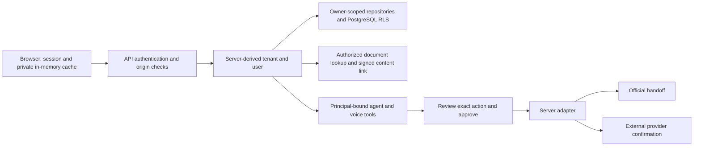

# ADAPT trust architecture

Audit date: **2 October 2026**. This document describes the implemented trust boundaries, the audit changes, and the evidence available from this workspace.

ADAPT prepares private plans and documents, explains source-supported requirements, and hands users to official channels. A finished agent run means that planning finished. It does not mean a government application was submitted or an appointment was booked. External success is a separate, provider-confirmed state.

## Identity and private data

The browser calls authenticated API routes. It has no database connection, database credentials, arbitrary SQL endpoint, or route for selecting another user's private graph. The server derives both `user_id` and `tenant_id` from the signed session and passes that principal into repositories, tools, and background jobs.



Every application transaction sets PostgreSQL's transaction-local `app.user_id` and `app.tenant_id`. Public transactions explicitly clear both values, including when pooled connections are reused. Private table policies require both owner identifiers. Shared governance nodes are readable reference data; application users cannot write governance nodes. Graph edge checks reject links to another user's private nodes.

API and worker databases require a runtime role that cannot bypass RLS. The role check rejects superusers, `BYPASSRLS`, ownership of public tables, and disabled RLS on existing protected tables. Migration credentials belong to a separate owner connection. SQL parameter values are hidden in engine diagnostics. Raw LangGraph checkpoints are internal worker storage: owner-scoped run lookup precedes worker access, and no frontend route exposes arbitrary checkpoint threads.

Private resources such as journeys, actions, approvals, research jobs, document analyses, and run events use the same principal boundary. An unknown or inaccessible resource returns an authorization-safe error. Sample-household sign-in creates a fresh account and freshly seeded private data for each visitor, so the demonstration does not put visitors into a shared household account.

Implementation: [API dependencies](backend/app/api/deps.py), [database sessions](backend/app/db/session.py), [RLS policies and triggers](backend/app/db/rls.py), [journey workers](backend/app/agents/journey/jobs.py), [authentication routes](backend/app/api/routes/auth.py).

## Document authorization and storage

Uploaded document bytes use encrypted local storage with opaque server-generated storage keys. File paths are never accepted from the browser. A document content request must pass all of these checks before storage is read:

1. A valid authenticated session.
2. A short-lived HMAC link bound to the tenant, user, document ID, and expiry.
3. An owner-scoped document lookup under RLS.

The default link lifetime is five minutes. Possessing a link alone grants no document access. Content responses use `no-store`, `nosniff`, and a restrictive document CSP. The PWA service worker uses network-only access for API and private document paths. Private live API data stays in the browser's in-memory query cache; sign-out cancels and removes private queries and ends the voice conversation. The separate mock mode uses tab-scoped storage and clears it on mock sign-out.

Production requires an explicit document encryption key. Development replaces the known example session secret with a persistent random installation secret stored beside encrypted documents. That secret must remain available to both API and worker processes. If encrypted documents exist but the prior local key is missing, startup refuses to silently choose a new key. An explicit encryption key avoids coupling document encryption to a development session secret.

Document processing can send authorized document content to the configured live OCR provider. Encryption at rest and log redaction do not mean document content is never processed outside the server. Demo adapters use synthetic results.

Implementation: [document routes](backend/app/documents/router.py), [document signatures](backend/app/core/signing.py), [encrypted storage](backend/app/adapters/storage.py), [development secrets](backend/app/core/development_security.py), [PWA policy](frontend/vite.config.ts).

## API authorization and browser requests

Private routes require a signed principal; malformed tokens fail with an authentication error. Owner identifiers in user input cannot replace the authenticated principal. Cookie-authenticated mutations require a trusted browser origin. Cross-origin mutations are rejected before request parsing, uploads, and side effects. Cookie-authenticated WebSocket connections require the same origin check. Non-browser bearer clients can operate without an Origin header.

All API responses, including failures, use `no-store`. Production settings reject the example signing secret, short signing secrets, insecure cookies, enabled demo authentication, SQL echo, an HTTP public URL, and wildcard CORS.

The current sign-in implementation supports demonstration sessions. Production disables those sessions; this repository does not yet supply an enterprise identity-provider integration. Signed sessions are stateless and expire according to the configured lifetime. Clearing the sign-out cookie does not revoke a copied token on the server. Enterprise SSO and server-side token revocation must be implemented before positioning this demonstration as a production enterprise authentication system.

Implementation: [session verification](backend/app/core/security.py), [HTTP origin middleware](backend/app/core/middleware.py), [shared origin validation](backend/app/core/origins.py), [production settings](backend/app/core/config.py).

## OpenAI credentials and voice sessions

The primary OpenAI API key is server-side configuration. Browser source, public assets, and production bundles must not contain it. Vite rejects credential-bearing `VITE_*` names, OpenAI key-shaped values under arbitrary aliases, and aliases containing the configured primary key. The browser artifact scanner checks source, public assets, build output, and source maps without printing credential values.

Voice obtains a server-minted OpenAI client secret with a requested 120-second lifetime. The browser sends it only to the exact configured OpenAI Realtime calls endpoint; redirects, untrusted targets, browser cookies, and caching are disabled for that handshake. The primary API key is never returned to the browser.

ADAPT's separate signed voice session is bound to **both tenant and user** and expires after two hours. Every tool call still requires API authentication and executes through that user's authorized API gateway. Model-provided tool names, arguments, and resource IDs do not confer access. Redis atomically enforces these budgets:

| Budget | Limit |
| --- | --- |
| Session creation | 10 per minute per tenant/user identity |
| Tool calls | 60 per minute per identity; 300 per voice session |
| Text turns | 20 per minute per identity |
| Text tool loop | 4 rounds; at most 4 calls per round |

Each voice session/call-ID pair is claimed atomically once before executing a tool, preventing concurrent replay. Redis unavailability returns a service-unavailable error; rate limits do not fail open. Voice result shaping masks identity fields, removes storage and signed-content links, and keeps source and resource metadata needed for the interaction. Sign-out closes the microphone/connection and clears the conversation. Provider errors are not dumped into the browser console.

Implementation: [voice provider](backend/app/adapters/voice.py), [voice guard](backend/app/voice/guard.py), [voice service](backend/app/voice/service.py), [voice result shaping](backend/app/voice/shaping.py), [browser handshake](frontend/src/features/voice/realtime/connection.ts).

## Sources, RAG, and government claims

Web research uses citation annotations attached to returned text. An incomplete response, missing citations, invalid citation spans, or unsafe citation URLs cannot become successful grounded research. A provider's list of consulted sources alone is not proof for a claim. Unsupported official claims are dropped. Live source-supported government research is official guidance; an authoritative rule requires the reviewed evidence path.

The official-source check requires HTTPS and an exact allowlisted domain or a real subdomain. Credentials in URLs, deceptive suffixes, and nonstandard ports do not establish official provenance. An official label identifies the source and evidence tier; it does not imply a government partnership or permission to act for an authority.

Research page fetching rejects private, loopback, link-local, and other nonglobal IPs. It pins the validated public IP while preserving the Host header and TLS server name, revalidates redirects, limits body size and content types, and disables environment proxy inheritance. Contact information is verified against a fetched page on the same registrable domain.

RAG evidence exposes source title, URL, publisher, retrieval date, section/page, effective date when known, quote-versus-paraphrase, freshness, source family, and passage/chunk identity. These fields survive retrieval, journey checkpoints, saved plans, and API presentation. A paraphrase is not displayed as a verbatim quotation. Missing evidence produces an explicit gap rather than an invented requirement. Private document evidence retains the authorized document reference.

The cultural guide distinguishes four categories in its product labels:

| Label | Meaning |
| --- | --- |
| Official rule | Reviewed authoritative requirement with official evidence |
| Official guidance | Advice supported by an official publisher |
| Social practice | Source-supported community or customary practice |
| AI recommendation | ADAPT's recommendation, with its basis where available |

Community results expose their source and last-checked information. Results identify live web research versus a curated source snapshot. Missing check dates are displayed as unavailable. Research uses a 30-day recheck window; the governance corpus uses a separate 180-day freshness policy. Old, invalid, or future timestamps cannot make evidence appear current. An effective date is kept separately from the date a page was checked. These dates describe stored evidence; they do not imply that every page was fetched during the current request.

Implementation: [provenance rules](backend/app/domain/provenance.py), [web research adapter](backend/app/adapters/web_search.py), [safe page fetching](backend/app/adapters/web_fetch.py), [research processing](backend/app/research/processing.py), [research freshness](backend/app/research/sources.py), [RAG evidence](backend/app/knowledge/evidence.py), [journey evidence contract](backend/app/agents/journey/schemas.py), [source display](frontend/src/components/ui/SourceLink.tsx), [discovery cards](frontend/src/features/discover/components/DiscoverCard.tsx), [trust labels](frontend/src/components/ui/TrustBadge.tsx).

## Sensitive attributes

Facts retain their source and user-confirmation status. Sensitive attributes including religion, ethnicity, caste, sexual orientation, political opinion, health conditions, and disability cannot be inferred or extracted into the private twin. They must be explicitly user-stated; faith-related personalization also requires explicit opt-in. Normalized attribute names cannot bypass this restriction. Personalization uses a closed fact vocabulary, and journey intake does not infer these attributes from names, language, nationality, or document content.

Implementation: [sensitive fact rules](backend/app/domain/twin.py), [personalization](backend/app/personalization), [journey intake](backend/app/agents/journey/intake.py).

## Human approval and truthful external status

Approval records are bound to the action, owner, and tenant. Expired approval cannot authorize execution. The reviewed action scope becomes immutable: payload, action type, service, adapter, official URL, simulation flag, approval requirement, consequences, and execution parameters cannot be changed under an existing approval. A changed scope needs a newly prepared action and a new review. Conflicting duplicate review decisions are rejected. Immediate execution locks the action row and rechecks its state before invoking the adapter.

| Product state | Evidence required |
| --- | --- |
| Prepared | A plan, draft, checklist, or action exists |
| Ready to book | Appointment preparation is ready; no booking receipt exists |
| Official handoff | The user can continue with the official/external channel |
| Needs user action | Required input or review is still outstanding |
| Submitted / Completed | A real, nonsimulated server adapter confirms the outcome with a nonblank external reference and approved scope |
| Booked / confirmed appointment | The external provider returns a matching booking receipt with provider, reference, and confirmation time |

User reports of submission or completion are preserved as **unverified reports**. They do not set adapter confirmation, external-success status, or a verified booking. A user cannot manually complete a government service or appointment through the preparation-task completion endpoint. Agent run completion and scenario saving cannot imply external success.

These rules are enforced in domain transitions, adapter results, database checks/triggers, API output contracts, saved node projections, frontend status mapping, and voice summaries. The frontend also suppresses unsupported success in stale or malformed data. Current government adapters prepare previews or official handoffs; the repository does not ship a government submission or booking integration that can claim external completion.

Migration `0006_trust_boundaries` preserves historical unsupported success reports as unverified notes, corrects action and appointment states, repairs linked node projections and affected plan summaries, adds booking-receipt storage, and strengthens approval constraints. Downgrading does not recreate the old unsupported success claims.

Implementation: [action domain](backend/app/domain/actions.py), [action execution](backend/app/agents/journey/service.py), [journey summaries](backend/app/agents/journey/nodes/human.py), [database models](backend/app/db/models/actions.py), [appointment contract](backend/app/contracts/appointments.py), [migration](backend/migrations/versions/20261002_0006_trust_boundaries.py), [frontend status mapping](frontend/src/services/live/journeys.ts), [voice instructions](backend/app/voice/prompt.py).

## Error handling and logs

Expected failures use structured problem responses with stable codes. Unexpected failures return a safe generic error. Provider outages, unavailable evidence, and rate-limit failures do not become fabricated successes. Request IDs allow support correlation without recording request content.

Access logs record method, route template, status, and duration. They exclude raw paths, queries, headers, cookies, uploads, document bodies, and prompts. Logging filters remove document/OCR fields, passport and marriage-document content, personal values, and credentials from structured extras. Exception output retains exception type and frame locations while discarding messages, source lines, and exception chains that might contain document content or SQL values. The JSON and text logging paths share these protections; unfiltered Uvicorn access logging is disabled, and provider/SQL library logs pass through the redacting handlers.

Implementation: [safe errors](backend/app/core/errors.py), [redaction](backend/app/core/redaction.py), [logging setup](backend/app/core/logging.py), [access logs](backend/app/core/middleware.py).

## Verification record

The audit added regressions for anonymous private-route access, HTTP and WebSocket origins, malformed sessions, tenant/owner document signatures, authorization before storage reads, RLS role refusal and context clearing, sensitive-attribute aliases, plaintext/JSON exception leakage, citation integrity, SSRF and redirects, voice limits and replay, approval expiry and scope changes, provider-only success, source metadata, cultural labels, freshness, unsafe links, and browser credential handling.

Verified in this workspace:

| Check | Result |
| --- | --- |
| Backend unit suite, including security regressions | **607 passed** |
| Frontend suite | **318 passed in 32 files** |
| Backend Ruff checks | Passed |
| TypeScript contract and frontend checks | Passed |
| Production frontend build | Passed |
| OpenAPI/TypeScript contract regeneration | Passed |
| Browser artifact credential scan | 608 files checked; no primary key pattern found |
| Vite credential rejection | Credential-shaped alias and `VITE_OPENAI_KEY` both rejected |
| Alembic upgrade and downgrade SQL generation | Passed offline |
| Database integration collection | 121 tests collected |

The local PostgreSQL service was unavailable, so database integration tests **were not executed** and migration `0006_trust_boundaries` **was not applied**. SQL generation validates migration assembly, not PostgreSQL execution or deployed RLS. Apply the migration with the owner connection and run the integration suite against a dedicated test database before demonstrating the migrated server. The suite rebuilds its test schema and must use the dedicated `ADAPT_TEST_DATABASE_URL` and `ADAPT_TEST_OWNER_DATABASE_URL` connections.

No configured primary OpenAI key was available for an exact-value artifact scan; the scan used key patterns. Live OpenAI calls and external government/booking providers were not exercised. Dependency advisory lookup could not complete because registry network access was unavailable. These remain verification limits, not passed checks.

Repeat the executable checks from the repository root (PowerShell):

```powershell
$env:PYTHONPATH='backend'
backend/.venv/Scripts/python.exe -m pytest backend/tests/unit -q
backend/.venv/Scripts/ruff.exe check backend/app backend/tests backend/scripts/audit_frontend_secrets.py backend/migrations/versions/20261002_0006_trust_boundaries.py
npm test
npm run typecheck
npm run build
backend/.venv/Scripts/python.exe backend/scripts/audit_frontend_secrets.py
# Requires the dedicated, reachable integration database and both test URLs:
backend/.venv/Scripts/python.exe -m pytest backend/tests/integration -q
# Run from backend/ with the owner migration connection configured:
# .venv/Scripts/python.exe -m alembic upgrade head
```
