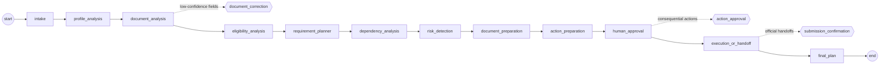

# Journey agent

The journey agent turns what a person says, what their profile and documents show, and the
cited governance graph into a dependency-ordered plan. It then prepares the next actions
and hands them over to official services, but only after the person approves. The agent
is a persisted, resumable LangGraph graph in `backend/app/agents/journey/`.

Two rules shape every part of it:

* **No invented obligations.** Every step, requirement and dependency comes from a governance
  node or edge that cites an official source. A risk always points at a governance node, a
  planned step or a fact ADAPT doesn't know. A goal the graph doesn't cover becomes a note,
  never a guessed step.
* **Nothing is "submitted" or "completed" because a mock ran.** Demo adapters return
  deterministic previews labelled `DEMO / SIMULATED` and stop at `handoff_required`. Only a real
  external reference, or the person's own confirmation of a step they did on the official
  site, can move an action further. This is enforced in code and again by the database.

## 1. Workflow

The graph is linear (`graph.py`). The three human gates are LangGraph `interrupt()` calls
inside the node that needs the answer. A gate is only raised when needed: no uploaded
documents means no correction gate, and no consequential actions means no approval gate.

| Node | Reads | Writes | What it does |
|---|---|---|---|
| `intake` | request | user_facts, evidence | LLM structured extraction (demo: deterministic keyword parser). No field exists for sensitive attributes |
| `profile_analysis` | user_facts | user_facts | Merges saved profile facts (`get_user_graph`). What the person just said wins. Records assumptions (e.g. mainland licensing) as `assumed` facts |
| `document_analysis` | document_ids, user_facts | user_facts, evidence, approval_requests | `analyze_document` (idempotent) per upload; **gate `document_correction`** when fields need review |
| `eligibility_analysis` | user_facts | governance_context, eligibility, evidence | Selects goal root services, loads the reachable subgraph (`get_governance_graph`), and evaluates eligibility rules three-valued |
| `requirement_planner` | user_facts, governance_context | tasks, requirements, evidence | Walks the graph into steps and requirements (`planning.py`); `retrieve_evidence` for every node used |
| `dependency_analysis` | tasks | tasks, dependencies | Typed edges, topological order, stages, ready/blocked, cycles |
| `risk_detection` | plan + facts + evidence | risks | `risks.py` (see §5) |
| `document_preparation` | tasks, requirements, facts, evidence | generated_documents | Checklists for ready steps, and a cover letter for spouse sponsorship. Drafts only |
| `action_preparation` | tasks, requirements, risks | actions | `prepare_action` / `prepare_appointment` for ready steps (max 5). No side effects |
| `human_approval` | actions | actions, approval_requests | **Gate `action_approval`** for consequential actions |
| `execution_or_handoff` | actions | actions, approval_requests | Executes approved actions through their adapter (official handoffs); **gate `submission_confirmation`** |
| `final_plan` | everything | final_summary, research_job_ids | Deterministic summary, saves the plan, starts background research |

## 2. State and node contracts

`JourneyState` (`state.py`) holds the spec's fields: `user_id`, `journey_id`, `request`,
`user_facts`, `governance_context`, `evidence`, `requirements`, `tasks`, `dependencies`,
`risks`, `generated_documents`, `actions`, `approval_requests`, `research_job_ids`, `events`,
`final_summary`. It adds `eligibility`, and `scenario` / `sim_trace` / `simulation` for
what-ifs. It is checkpointed after every node, so it holds **JSON types only**; a test walks
the state and fails on any enum or object.

Reducers decide how updates combine. Single-owner keys hold complete values. `user_facts`
merges by key. `evidence`, `actions` and `approval_requests` merge by id, so a node that
updates one action can't drop another. `events` (a compact journal of `node_start`,
`node_complete`, `tool_call`, `tool_result`, `approval_required`, `approval_resolved`) is
append-only.

**Typed input/output, enforced.** Each node declares an input and an output TypedDict in a
`NodeSpec` (`spec.py`). `@journey_node(spec)`:

* passes the node only the keys its input type declares, validated;
* rejects any key the output type doesn't declare (`NodeContractError`): a node can't
  silently change unrelated state;
* validates the output types, and emits `node_started` / `node_completed` / `node_failed` plus
  journal entries.

The same declarations (plus `fact_keys`, the facts a node depends on) drive what-if
re-execution (§6) and the topology served to the UI (`topology.py`).

## 3. Tools

`tools.py`: typed Pydantic inputs/outputs. Each call streams `tool_called` / `tool_result` and
is journalled; `tool_schemas()` exports them for function calling (LLM or voice).

| Tool | Backed by |
|---|---|
| `get_user_graph` | `personalization.planning_facts(for_requirements=True)`, the consent-gated flat facts with `fact_ids` |
| `get_governance_graph` | governance nodes/edges (reachable subgraph from given services) |
| `retrieve_evidence` | `knowledge.retrieval.retrieve` scoped to governance keys; each passage becomes an `official_passage` evidence record plus `official_reference` records for node citations |
| `analyze_document` | `documents.service.DocumentIntelligence.analyze` (idempotent, so it never re-reads on resume) |
| `generate_document` | checklists: deterministic. Letters/emails: LLM with "use only the given facts" instructions, or demo templates with visible `[placeholders]`. Provenance: ADAPT suggestion citing the official pages used |
| `prepare_action` / `prepare_appointment` | action adapters' `prepare()`, side-effect free |
| `start_research` | `research.service.start_research` (fire and forget) |
| `simulate_journey` | `simulation.run_simulation` |

## 4. Human in the loop and actions

### Gates

| Gate | Raised by | Asks | Answered with |
|---|---|---|---|
| `action_approval` | `human_approval` | approve/reject each consequential action | `POST /api/actions/{id}/approve\|reject` (the last decision resumes), or `POST /api/agents/{run}/resume` with `decisions[]` |
| `document_correction` | `document_analysis` | confirm or correct low-confidence fields | `POST /api/agents/{run}/resume` `{documents:[{document_id, corrections[], confirm}]}`. Finishing the review on the Documents page also resumes (`document_reviewed_listeners`) |
| `submission_confirmation` | `execution_or_handoff` | did you complete each handed-off step? | `{confirmations:[{action_id, outcome: submitted\|completed\|not_yet\|could_not_complete, reference?}]}`; `completed` needs a reference |

**Resume protocol.** When the graph pauses, `execute_run`'s `on_interrupt` hook (`gates.py`)
persists the payload to `agent_runs.pending_review`, saves the plan so far as a draft (so the
Review step can show context), and emits `approval_required` (one per action for approvals,
one per gate otherwise) before `run_status(awaiting_input)`. The UI renders the Review step
from `GET /api/agents/{run}/review`. An answer is validated against the pending review, then
the run is claimed atomically (`awaiting_input → queued` only while that same `review_id` is
pending, so a double submit gets 404/409) and `resume_journey` is enqueued with
`Command(resume=answer)` on the same `thread_id`.

**What the Review step reads.** `GET /api/agents/{run}/review` returns the gate as it was
asked, plus each action item's current `approval_status` / `decided_at` from its approval
row, so items decided one by one never look pending. Each decision recounts the open
approvals after its own commit: when two last decisions commit at the same time, exactly one
of them resumes the run. Answering the document-correction or submission-confirmation gate
emits `approval_resolved` under the review id, so every `approval_required` on the stream is
closed. A paused run can be stopped with `POST /api/agents/{run}/cancel` (`awaiting_input`
only): its open approvals expire and their actions return to draft; nothing was executed.

**Documents still being read.** A journey started right after an upload waits (up to 90 s)
for the upload's own reading job instead of planning without the document; the document row
is locked while a reader claims it, so it is read once.

**Idempotent re-runs.** LangGraph re-runs an interrupted node from the top on resume, so all
pre-interrupt work is repeatable: approvals are created once per action (`ensure_approvals`),
document analysis returns stored results, and execution re-reads stored actions and never
executes twice. The approval rows, not the resume payload, decide what was approved.

### Actions

| Type | Adapter (live) | Demo | Approval |
|---|---|---|---|
| `government_portal` | `GovernmentPortalAdapter`: official handoff (UAE PASS on the portal) | same (always real) | required |
| `appointment` | `AppointmentAdapter`: handoff to official booking | + deterministic example slots, `DEMO / SIMULATED`, `booked: false` | required |
| `document_submission` | `DocumentSubmissionAdapter`: handoff | + deterministic completeness check, `submitted: false` | required |
| `official_handoff` | `OfficialHandoffAdapter`: opens the official page | same | not required (informational) |

`ADAPTER_ACTIONS=auto|live|demo`: auto means demo previews outside production and real handoffs
in production; demo is refused in production.

Statuses: `draft → prepared → awaiting_approval → approved → handoff_required → submitted →
completed`, plus `blocked` and `failed`. A rejected action goes back to `draft` (the approval row
records `rejected`). `app/domain/actions.py` holds the state machine (`check_transition`):

* only the user's approval approves;
* the agent can never set `submitted` / `completed`, and a simulated adapter can't either;
* `completed` needs an external reference; `handoff_required` needs an official https URL;
* an `ApprovalGrant` is bound to one action, so approving A can't authorise B.

The database repeats this: CHECK constraints on `actions`, and a trigger that requires an
`action_approvals` row with status `approved` before `approved` / `submitted` / `completed`.

## 5. Planning and risks

`planning.py` is pure. Goals (derived on read from facts, so what-ifs propagate) select root
services (`GOAL_ROOTS`, checked against the real seed by tests). Expansion follows the edges:
`depends_on` service → prerequisite step; `depends_on` dependency → one `satisfied_by` option
chosen by its `when` (e.g. jurisdiction); `requires` document → satisfied when held, else
produced by another step, else **missing**; `requires` requirement → an off-platform step
unless `meets.*`, or, when the requirement is marked `informational` (the authority checks it
while processing, e.g. the security check), a `checked_by_authority` requirement that never
blocks; `may_require` appointment → an appointment step that inherits its service's
prerequisites (you can't book biometrics before the application exists). A step's official
link is its own page, else its portal, else the first official page it cites. Edge `party`
decides whose step or document it is (sponsor/household → the user, beneficiary → the
spouse). Eligibility rules attached with `party: beneficiary` (e.g. "who a resident can
sponsor") are evaluated against the spouse's facts. A `when` condition
that doesn't hold drops the requirement; one ADAPT can't decide drops it too and records an
**unknown** requirement naming the missing fact, so ADAPT asks instead of inventing.

Risk kinds (`risks.py`): `missing_user_document`, `missing_information` (assumptions, facts a
rule or conditional requirement needs, coverage gaps), `missing_source_evidence` (curated
values without a quoted official passage, steps without a citation), `timeline_dependency`
(e.g. spouse sponsorship can't start at arrival: the prerequisite chain is listed),
`incompatible_task_ordering` (dependency cycles; a step reported done before its prerequisite),
`external_login_required` (UAE PASS steps), `eligibility_gap` (a checkable rule the stated
facts don't meet; a warning unless backed by a quoted passage).

### Things you may not have considered

`considerations.py` runs over the saved plan (`store_pg.save_plan`) and fills
`journeys.considerations` (`ConsiderationOut` on `GET /journey/{id}`). A consideration is a
cited consequence across areas, not a risk and not a step. Each rule must cite official
passages the plan already holds, or it is dropped. Rules: `attestation_abroad` (the
certificate's chain starts where it was issued; worded for whether the home-country stamp is
already there) and `lease_before_family_visa` (the family visa's housing proof is a lease
registered in Tawtheeq, which waits on the sponsor's own visa and Emirates ID). What-ifs get
their own, so moving alone first drops both.

### Repeatable runs

`POST /journey {deterministic: true}` makes that run use the rule-based intake parser and the
drafting templates even when an LLM key is configured, and start research on the curated
snapshot. What-ifs of such a plan inherit it. `final_plan` reuses a research job already
started for the journey instead of starting another. Used by the Founder Arrival demo
([demo-founder-arrival.md](demo-founder-arrival.md)).

## 6. What-if simulation

`simulation.py`. `POST /api/journey/{id}/simulate {changes:[{key, value}]}` creates a scenario
journey and runs `run_what_if`:

1. The base run's checkpointed state is **read** (`aget_state`, never updated) and deep-copied
   into a new thread. The services are read-only (`ReadOnlyStore` raises on any write), and
   drafts and actions are previews.
2. `apply_scenario` overrides facts. Only variables in `SCENARIO_VARIABLES` are allowed; values
   are type-checked; a variable absent from the base journey is fine.
3. Each analysis node re-runs **only** if a fact it declares changed, or if an earlier re-run
   changed a key it reads. Changes are measured against the base journey's values (per-node
   projections), so a re-run that reproduces the base result stops propagation. Example:
   changing income re-runs eligibility and risks, not the planner.
4. `compare_scenarios` returns `changed_nodes`, `added_tasks`, `removed_tasks`,
   `changed_dependencies`, `changed_risks`, `rerun_nodes` and a summary. The result is stored on
   the scenario journey before `run_completed` is emitted.

The what-if topology (`GET /api/agents/what_if/topology`) is drawn as a branch off the base
pipeline; the streamed `node_started` events show which stages re-ran.

### Editing a plan without a run

`POST /api/journey/{id}/nodes/{key}/done` records `completed.<step>` as stated by the user.
`POST /api/journey/{id}/nodes/{key}/answer {answer, key?}` answers one of the node's
`details.open_questions` (most decisive first: eligibility facts, then conditional-requirement
facts). Both re-plan with the same pure functions as the graph (`updates.py`): no LLM, nothing
executed. The facts are kept on the journey plan, and a later what-if copies the persisted plan,
so it includes these edits.

## 7. Streaming

| Spec | Wire event (flat JSON, `event` discriminator) |
|---|---|
| node_start / node_complete | `node_started` / `node_completed` (+ `node_progress`; failures emit `error` with the node) |
| tool_call / tool_result | `tool_called` / `tool_result` (`call_id`, `tool`, `summary`, `ok`) |
| approval | `approval_required` (`gate`, `item_count`, `approval_id`, `action_id?`), `approval_resolved` |
| also | `evidence_found`, `document_generated`, `action_prepared`, `run_status` (`awaiting_input`) |

## 8. Persistence

* Checkpoints: `AsyncPostgresSaver` (schema `langgraph`); `thread_id` on the RLS-protected run.
* `final_plan` (and each pause, as a draft) writes `journeys.plan` (snapshot),
  `journeys.considerations` (risks), `journeys.assumptions` (facts), `journey_nodes` (one per
  step: status merged with its action, blockers, official provenance, `basis` = fact ids only)
  and `journey_edges`. Scenarios are separate journeys (`status=scenario`, `parent_journey_id`,
  `simulation`).
* `actions`, `action_approvals` and `generated_documents` are written as they happen; all RLS
  owner-only.

## 9. Tests

`backend/tests/unit/journey/` (unit, no services) covers the planner, eligibility, risks, the
node contracts, graph transitions and all three gates, approvals and idempotent resumes,
action honesty and adapters, what-if (no mutation, minimal re-runs, new variables), the
topology/graph match, and planner compatibility with the real cited seed.
`backend/tests/integration/test_journey_agent.py` runs the HTTP routes and jobs on PostgreSQL
with a fresh checkpointer per job. It covers RLS isolation, the approval trigger, CHECK
constraints refusing forged statuses, and what-if leaving the base journey unchanged.

## 10. Known limits

* Goals are limited to company setup, founder residency, spouse sponsorship and housing
  registration (`GOAL_ROOTS`). Anything else is reported as not covered.
* There is no clarifying-question gate. Missing information becomes a risk, which the person
  answers on the step (`/nodes/{key}/answer`) or in their profile. Answers given on a step are
  kept on that journey; writing them back to the user twin is future work (it needs the
  personalization vocabulary for planning keys).
* A resume payload travels in the ARQ job. If Redis loses the job, the run stays `queued`
  (visible, not lost). A re-enqueue tool is future work.
* Eligibility uses the same machine conditions as the knowledge layer but its own evaluator.
  Switching to `knowledge.evaluator.RequirementEvaluator` would unify explanations.
