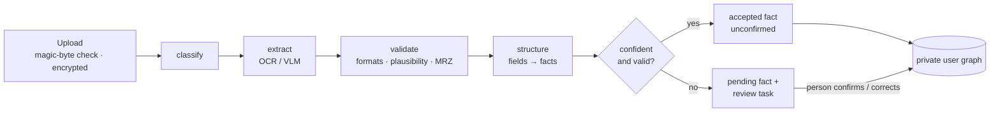

# Private user digital twin and document intelligence

Owner: document intelligence & personalization. Code: `backend/app/personalization/`,
`backend/app/documents/`, `backend/app/adapters/ocr/`, `backend/app/db/models/user_data.py`,
migration `0004_user_data`.

The private user graph (the *twin*) holds one person's situation: who they are, who moves
with them, what they hold, what they want. It is separate from the shared governance graph.

**Core rule:** public governance knowledge never enters user-owned storage as if it were
personal information. The twin links to governance nodes *by reference* (`instance_of`,
`pursues`, …), never by copying their content, and user-graph nodes carry no properties. Every
personal detail is a fact row with provenance.

## 1. Model

```
graph_nodes (graph_type='user')     entities: person.self (hub), spouse, child, passport, …
graph_edges (graph_type='user')     relations: person -has_household_member-> spouse, …
                                    private links: passport -instance_of-> document.passport (governance)
extracted_facts                     one row per (entity, attribute, status) with provenance
review_tasks                        what the person needs to check
user_documents                      uploads (bytes encrypted in document storage)
```

**Facts.** `value` (canonical JSON), `confidence` (0–1), `source`
(`user_stated` | `document_extracted` | `inferred` | `system`), `source_document_id`,
`extraction_method` (`local:pdf-text+mrz`, `openai:<model>`, `user_entry`, `user_correction`),
`source_ref` (e.g. `profile:user_goals:<id>`), `field` (the document field it was read from),
`status` (`accepted` | `needs_review`), `confirmed_by_user`, `corrected`, `issues`.
At most one accepted and one pending value per (entity, attribute).

**Structure follows facts.** Adding the first fact about a spouse creates the spouse entity and
its edge from the person. Removing the last fact removes the entity. `person.self` always
exists. Keys are deterministic and contain no personal data (`spouse.self`,
`nationality.<sha256-prefix>`), because keys can appear in logs and events. Labels come from
facts (e.g. "Passport · India").

### Vocabulary (closed: unknown attributes are rejected)

| Entity | From parent | Parents | Instances | Attributes |
|---|---|---|---|---|
| person | hub | – | one | full_name, date_of_birth, occupation, employer, job_title, monthly_income, employment_start_date, employer_provides_accommodation, current_country |
| household | member_of | person | one | moving_together, planned_arrival_date, size |
| spouse | has_household_member | person | one | full_name, date_of_birth, married_on, marriage_country, moving_with_user, occupation |
| child | has_household_member | person | many (by name) | full_name, date_of_birth, moving_with_user |
| passport | has_document | person/spouse/child | many (by issuing country) | issuing_country, expiry_date |
| visa | holds_visa | person/spouse/child | many (by type) | visa_type, country, status, expiry_date |
| nationality | has_nationality | person/spouse/child | many (by country) | country |
| company | founder_of | person | many (by name) | name, jurisdiction, legal_form, stage, registration_authority |
| business_activity | engages_in | company | many | description |
| goal | has_goal | person | many (by kind) | kind, description, target_date, priority |
| housing_preference | prefers | person | one | preferred_area, property_type, bedrooms, tenure, move_in_date |
| budget | has_budget | person | many (by category) | category, amount, period |
| language | speaks | person/spouse/child | many | language, proficiency |
| preference | prefers | person | many (by topic) | topic, value |
| document | has_document | person/spouse/child | one per upload | document_kind, title, issuer, issuing_country, issue_date, expiry_date, attested, registered, property_*, tenancy_*, annual_rent |
| appointment | has_appointment | person | many | title, scheduled_for, location, status |
| community_preference | seeks | person | many (by interest) | interest, language, faith_community *(sensitive)* |

Values are normalised by kind: ISO dates, ISO 3166-1 alpha-3 countries (accepts names and
nationality adjectives such as "INDIAN"), ISO 639-1 languages, money `{amount, currency}`,
booleans, and fixed choices. The schema is served at `GET /api/graph/user/schema`.

**Minimum passport data.** Only the issuing country and expiry date live on the passport. Name
and date of birth go to the holder, and nationality becomes a nationality entity. Document
numbers are never requested from any reader, so they can never be stored.

## 2. Document pipeline



* **Runs in the worker** (`process_document`, its own `document_extraction` run with SSE
  progress per stage), or inside another agent via
  `DocumentIntelligence(db, principal, adapters, events).analyze(document_id)`. `analyze` is
  idempotent: a document that was already read is not read again.
* **Readers** (`app/adapters/ocr`) sit behind a provider-neutral port: `DocumentReader.read(
  ReadRequest{content, content_type, types, type_hint}) -> ReadResult{method, detected_type,
  type_confidence, fields, machine_readable_zone}`. Readers get a generic schema (field names,
  descriptions, printed labels, markers) and know nothing about passports or twins.
  * `LocalTextReader`: text layer of digital PDFs, offline and exact. Nothing leaves the server.
  * `OpenAIVisionReader`: images and scans via the Responses API, transcribe-only, `store=False`.
  * `ChainedReader`: local first, vision when a key is configured and the local reading is too thin.
* **No fake OCR.** There is no reader that returns canned values. If nothing can read an
  upload (a photo without an API key, a failed provider call), the document goes to
  `needs_review` with an `extraction_failed` task and no facts are created.
* **Classification.** The kind the person chose wins. The reader's detection is still
  compared, and a confident disagreement opens a `kind_mismatch` task. Without a choice, the
  reader's detection is used; failing that, `miscellaneous`.
* **Validation calibrates confidence.** Reader confidence is a starting point. Values are
  normalised; implausible ones (birth dates in the future, expiry before 1990) and ambiguous
  ones (03/04/2020) are capped. Passports and ID cards are cross-checked against their MRZ
  (ICAO 9303 check digits): agreement raises confidence to 0.98, disagreement caps it at 0.5
  and opens a review, and a verified MRZ fills fields the visual zone missed.
* **Structuring** maps each kind onto the vocabulary: passport → holder name/DOB, nationality,
  passport; marriage certificate → spouse (the party that isn't the person, matched by name)
  and the spouse's date of birth when printed, plus certificate facts including `attested`
  (UAE attestation) and `home_attested` (the issuing country's foreign ministry); employment letter → employer, job title, income,
  accommodation; business document → company, jurisdiction (ADGM / mainland from the
  authority, or the planned jurisdiction of a business plan or profile), activities, and
  stage (`registered` for a licence, `idea` for a plan, which no authority issued); tenancy → tenancy facts including `registered`; identity document →
  holder, nationality, card facts. A name on the document that doesn't match the holder flags
  every fact for review.
* **Confidence threshold** `0.85`. Below it, or with any issue, the fact is `needs_review`
  with a `low_confidence` task. A value that differs from one already in the twin never
  replaces it: it becomes a `conflict` task. A value that agrees with the twin isn't written
  twice; the document's field points at the existing fact and still shows what was read.
* **Planning facts from documents** include `spouse.person.age` (from the spouse's date of
  birth) and `meets.home_country_attestation` (a marriage certificate the issuing country has
  attested, when there are no children whose certificates would need the same step).
* **Lifecycle:** `uploaded → processing → extracted | needs_review → confirmed`; `failed` for
  files that can't be processed; `deleted` (bytes destroyed, facts removed, tombstone row).

## 3. Correction flow and API (all under `/api`, owner-only)

| Route | Purpose |
|---|---|
| `POST /documents/upload` (multipart `file`, `kind?`, `subject=self\|spouse\|child`, `subject_node_id?`) | 202, reading runs in the worker; `events_url` streams progress |
| `GET /documents` · `GET /documents/{id}` | metadata · fields, facts, open review tasks, signed `content_url` |
| `POST /documents/{id}/review` `{corrections:[{name,value}], confirm}` | correct fields and confirm the rest in one step |
| `POST /documents/{id}/process` `{kind?}` | read again (optionally as another kind); keeps what the person confirmed |
| `GET /documents/{id}/content?expires&sig` | bytes; session **and** short-lived HMAC signature; `no-store` |
| `DELETE /documents/{id}` | destroy bytes, remove every fact read from it |
| `GET /graph/user` | entities with facts, edges, linked governance nodes (public references) |
| `POST /graph/user/facts` · `PATCH /graph/user/facts/{id}` · `DELETE /graph/user/facts/{id}` | state · confirm/correct · reject/remove |
| `GET /graph/user/schema` | what can be recorded |
| `GET /graph/user/personalisation` | what ADAPT takes into account, with the facts behind each item |
| `POST /graph/user/explain` `{fact_ids}` | why a recommendation applies |
| `GET /review-tasks?status=&document_id=` · `POST /review-tasks/{id}/dismiss` | the review inbox |

Confirming (`PATCH {confirm: true}`) accepts a proposal and marks it confirmed. Correcting
(`PATCH {value}`) keeps the document as context (`corrected: true`, "Corrected by you
(originally read from your passport)"). Deleting a proposal rejects it. Each action resolves
the fact's review task. When a document's last task closes it becomes `confirmed`, and
`app.documents.hooks.document_reviewed_listeners` are called, which lets the journey agent
resume a run paused at its correction gate.

## 4. Explanations: which of your details were used

`planning_facts(session, principal, keys=None, *, for_requirements=False)` projects accepted
facts onto flat keys shared with the knowledge layer (`app/knowledge/facts.py`) and the
journey agent. Each planning fact lists the `fact_ids` it rests on:

* shared rule inputs: `documents.<doc>` (from `instance_of` links), `finance.monthly_income_aed`,
  `housing.accommodation_provided`, `company.jurisdiction`, `household.move_with_spouse`, `person.age`
* planning context: `person.occupation`, `household.children_count`,
  `household.planned_arrival_date`, `nationality`, `passport.expiry_date`, `company.stage`,
  `company.activities`, `goals`, `housing.preferred_area`, `languages`,
  `community.interests` (community consent), `community.faith` (faith consent, user-stated only)
* household members are prefixed: `spouse.documents.passport`, `child1.person.age`
* `for_requirements=True` drops `community.*` so special-category data never reaches a
  requirement check

A spouse read from a marriage certificate yields `household.move_with_spouse = true` with
source `inferred` (not confirmed) until someone says otherwise, so the plan asks rather than
assumes. Consumers store the `fact_ids` they used (journey nodes' `basis.fact_refs`, research
results' `fact_ids`) and render them with `explain(session, fact_ids)`:

> **Moving with a spouse** ← Spouse · Full name: read from your marriage certificate, not yet confirmed

A fact deleted since is rendered as "A detail you have since removed".

**Onboarding.** The profile tables stay canonical for onboarding answers.
`project_profile(session, principal, bundle)` rewrites their user-stated facts
(`source_ref = profile:<table>:<id>`) after each save. It never overwrites a value that came
from a document or a direct statement, and it removes what the profile no longer says.

## 5. Privacy

* **Isolation.** Owner-only RLS on `user_documents`, `extracted_facts`, `review_tasks`; every
  query also filters on `user_id`. Triggers reject facts on governance nodes or on another
  user's nodes or documents (FK checks bypass RLS). A CHECK keeps user-graph nodes' `properties_json`
  empty. Tested with unfiltered queries across users and through every route.
* **No user graph in public endpoints.** Only `/graph/governance` is public, and a test
  searches it for a user's name.
* **No raw PII in analytics** (`app/personalization/analytics.py`): allow-listed keys only;
  values must be booleans, numbers or vocabulary tokens; no user ids. Logs carry ids, never
  values (`app/core/redaction.py` is the safety net). Run events carry stage names and counts.
  All three are tested against a real extraction.
* **Documents.** Fernet-encrypted at rest; content type from magic bytes; bytes served only
  with the session plus a 5-minute signature, `no-store`, `nosniff`, and a restrictive CSP;
  never in browser storage (the frontend holds signed URLs in memory only).
* **Extraction records are private.** `user_documents.extraction` holds a value-free summary
  (method, per-field confidence, issues, fact ids); values live only in `extracted_facts`.
* **Consent.** Faith attributes are user-stated only (Pydantic, service, DB CHECK) and need
  `faith_personalization = granted`.

## 6. Demo

Without an OpenAI key, digital PDFs are read locally. Generate the clearly marked specimen
set (passport with a valid MRZ, marriage certificate with an unreadable attestation, ADGM
licence, salary certificate, tenancy contract):

```bash
cd backend && uv run python -m app.documents.specimens ../demo-documents
```

Uploading the passport yields MRZ-verified facts. The marriage certificate adds the spouse and
opens one review task ("Attestation: Pending" is neither yes nor no). Correct it and
`household.move_with_spouse` explains itself. A phone photo without a key goes to review
with no invented values.

The "Founder Arrival" scenario has its own synthetic set (passport, marriage certificate
with spouse dates of birth and attestation lines, business profile), generated by
`uv run python -m app.demo_scenarios.documents ../demo-documents/founder-arrival`. Every
field reads back at or above the review threshold. See
[demo-founder-arrival.md](demo-founder-arrival.md).

## 7. Tests

* unit: `test_user_graph_vocabulary.py`, `test_document_reading.py` (local, OpenAI with a fake
  client, chain), `test_document_intelligence.py` (MRZ, validation, structuring),
  `test_personalization_projection.py`, `test_privacy_analytics.py`
* integration (real Postgres): `test_document_pipeline.py` (upload, lifecycle, confidence,
  review tasks, correction flow, conflicts, kind mismatch, re-processing, signed content,
  deletion, isolation, public endpoints, no PII in events/logs/analytics, agent port) and
  `test_user_graph.py` (graph creation, identity reuse, validation and consent, pruning,
  RLS and trigger invariants, profile projection, planner contract)

## 8. Known limits

* Offline reading covers digital PDFs only. Photos and scans need a vision provider (or the
  person's review).
* The marriage certificate distinguishes the spouse by name. Before the person's own name is
  known (e.g. no passport yet), both names go to review.
* One primary company drives `company.*` planning keys.
* Children in planning keys are numbered in the order they were added.
