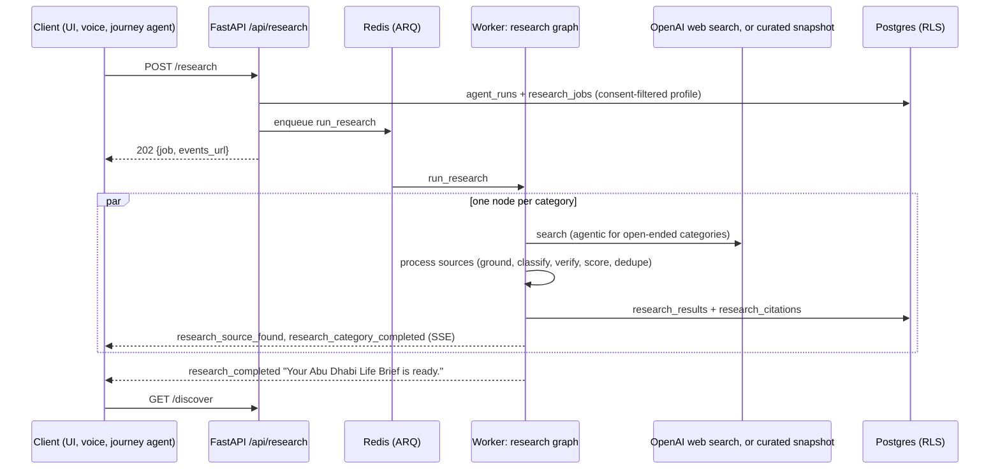

# Abu Dhabi research (W7)

Background research that builds a person's **Abu Dhabi Life Brief**: communities, places of
worship (only on request), professional networks, events, cultural guidance, everyday
surprises and a starter kit. It runs in the ARQ worker. The API, the journey agent and
voice start it and never wait for it.

Code: `backend/app/research/`. Migrations: `20260929_0003r_research.py` (revision
`0003_research`) and `20260929_0005r_research_fact_ids.py` (`0005_research_fact_ids`). Frontend adapter: `frontend/src/services/live/research.ts`.
Curated data: `backend/app/seed/catalogue.yaml`.

## Flow

Graph: `prepare_research → research_<category> × N (in parallel) → compile_brief`.
A failing category is reported and the others carry on. The run fails only if every
attempted category failed. `research_failed` is always emitted before `run_failed`.

## Research types and Discover sections

| Category | Discover section | Search |
|---|---|---|
| `community` | Your Communities | agentic |
| `faith_and_worship` | Your Faith & Places | agentic; **only after explicit opt-in** |
| `professional_network` | Your Professional Network | agentic |
| `events` | Local Events | agentic |
| `culture` | Cultural Guide | quick, restricted to official domains |
| `lifestyle` | Things That May Surprise You | quick (official domains for rules) |
| `starter_kit` | Starter Kit | quick (official domains for services) |

## Key decisions

| # | Decision | Why |
|---|---|---|
| R1 | **A vertical slice** (`app/research/`): types, profile, sources, queries, prompts, engines, processing, graph, models, repository, service, API, task. Platform files only gain hooks. | Parallel workstreams without git: no shared files to collide on. |
| R2 | **Two engines, one pipeline.** `LiveResearchEngine` (OpenAI Responses `web_search`) whenever an API key is set; `SnapshotResearchEngine` (curated catalogue) otherwise. Both feed the same `SourceProcessor`, graph and events. | Real search is the default path. Offline demo is deterministic and exercises everything downstream. |
| R3 | **Agentic multi-step search** for open-ended categories: a reasoning model runs several searches and opens pages (`max_tool_calls` 10, effort `medium`). Then a separate structured extraction runs, and one gap-filling follow-up round if fewer than 3 grounded results. | Finding recognised organisations needs exploration. Separating search (citations) from extraction (typed output) keeps citations reliable. |
| R4 | **Query templates, not model-written queries**, plus a guard on model-proposed follow-ups. | What leaves ADAPT is auditable. Tests prove faith terms never appear without opt-in. |
| R5 | **Grounding:** a result may only cite URLs the search tool actually returned (or the catalogue lists). Anything else is dropped as invented. | "Do not fabricate" as a mechanism, not a prompt. |
| R6 | **Four claim kinds kept apart:** Law (`authoritative_requirement`), Official guidance, Community information (`community_web`), ADAPT suggestion. Law and official guidance need an official UAE domain. Otherwise an official citation is promoted to primary, or the claim is downgraded. The same rule is checked in `Provenance` and by a DB CHECK. | "Don't present ordinary web pages as legal requirements", enforced in three layers. |
| R7 | **Source labels, not scores.** Users see Official / Organization / Community / General web plus "last checked". The quality score (source type × freshness, plus corroboration) only ranks results and is never exposed by the API. | As specified: no arbitrary "truth score". |
| R8 | **Contacts are verified or not shown.** Phone, email and address survive only if found on the cited page. That page is fetched by an SSRF-guarded fetcher: public IPs only, ports 80/443, re-checked per redirect, 1.5 MB cap. A website survives only if it belongs to a cited domain. Offline, nothing is fetched, so no contacts are shown. | "Do not fabricate current contact information." |
| R9 | **Consent-filtered profile** (`ResearchProfile`): no name ever. Language sets only the output language. Background and interests need community consent. Faith needs a user-stated value plus faith opt-in. Explicit requests without consent get 409 `consent_required`. Implicit data is withheld silently and listed in `withheld`. | Never infer religion from nationality or ethnicity from name; use sensitive data only when given intentionally. |
| R10 | **Faith guard on results.** Without opt-in, faith-specific groups and events are removed from community, professional and events results. Culture keeps Ramadan etiquette: it applies to everyone living in Abu Dhabi. | Stops faith content being targeted via nationality or interests. |
| R11 | **Dedup at three levels:** canonical URLs (https, no `www.`, tracking params or fragments); results merged within a category (same title, or same page plus similar title) with citations unioned; each source announced once per job (`research_source_found`). | As specified. Different events on one listing page stay separate. |
| R12 | **One curated catalogue** (`app/seed/catalogue.yaml`) seeds the public catalogue tables and powers offline research. Every row was verified by loading its page on its `retrieved_at` date, with no phones, emails, prices or invented dates. `binding: true` marks a legal rule on an official page. | Offline data is real and honestly dated. Recurring events carry a `timing_note` instead of a date. |
| R14 | **Relevance is traceable to the user's own facts.** Stored facts come from `app.personalization.facts.planning_facts` (which is consent-gated itself). Each result keeps the `fact_ids` behind its "why this is relevant", so `POST /api/graph/user/explain` can show them. Withheld facts leave no ids, and facts the user restates in the request replace the stored ones. | One explanation style across the journey and Discover; consent holds all the way down. |
| R15 | **A job can pin the curated snapshot** (`mode: "snapshot"`), used by scripted demo runs; the worker honours it even with live search configured. Each result carries `retrieval` (method, label, note, date), and the snapshot breaks score ties by the curators' `position`, so the starter kit leads with TAMM and ICP. | Repeatable demos, and an honest per-result label. Alphabetical ties dropped essential services from the six shown. |
| R13 | Research event names follow the platform's flat format (`research_started`, …), and the payload models live in `app/contracts/events.py`. | Same stream, reducer and SSE replay as every other run. |

## API (under `/api`)

| Method and path | Returns |
|---|---|
| `POST /research` `{categories?, focus?, journey_id?, profile?, force?, mode?}` | 202 `{job, events_url}`. Idempotent while a job is active. 409 `consent_required` |
| `GET /research?limit=` | `ResearchJobOut[]`, newest first |
| `GET /research/{job_id}` | `{job, results}` |
| `POST /research/{job_id}/seen` | `ResearchJobOut` (brief-ready notice seen) |
| `PATCH /research/results/{id}` `{saved}` | `ResearchResultOut` |
| `POST /research/results/{id}/journey` `{journey_id?}` | `ResearchResultOut`. 409 `journey_required` |
| `GET /discover` | `{job, sections[7], saved, message}` |

Each result has: title, summary, relevance ("why it is relevant") plus the `fact_ids` behind
it, `evidence_kind`,
`source_label`, source url/title/domain, `retrieved_at` ("last checked"), `needs_recheck`
(more than 30 days), `retrieval` (curated snapshot or live web search, in words), citations, verified contacts, event timing, `saved`, `journey_node_id`.

## Events (on the run's SSE stream)

`research_started {job_id, categories, mode}` ·
`research_source_found {job_id, category, result_id, citation_id, title, url, source_domain, source_label}` ·
`research_category_completed {job_id, category, status completed|failed|skipped, result_count, reason}` ·
`research_completed {job_id, result_count, categories_completed[], categories_failed[], message}` ·
`research_failed {job_id, code, message, retryable}`

## Data

`research_jobs` (1:1 with `agent_runs`; categories, per-category status updated atomically,
the profile actually used, mode, completed/seen) → `research_results` (trust tier, source
label, internal score, verified contacts, event dates, fact keys and fact ids, saved, journey
node) →
`research_citations` (url, canonical url, title, domain, label, retrieved_at, summary,
category, primary flag). All three tables are owner-only RLS, and cascade on user deletion.

## Configuration

`OPENAI_API_KEY` switches research to live. `ADAPTER_WEB_SEARCH` and `ADAPTER_LLM` both
need to resolve to `live`. The search model is `OPENAI_RESEARCH_MODEL`, and extraction uses
the reasoning model for open-ended categories and the fast model otherwise. The per-category
timeout is 240 s.

## Testing

* `tests/unit/test_research_rules.py`: consent gating, faith guard, query privacy across all
  profiles, source labels, scoring and freshness, dedup, catalogue integrity (https, no
  contacts in text, law only on official pages), deterministic matching.
* `tests/unit/test_research_pipeline.py`: grounding, law downgrade and official promotion,
  contact verification, past events, dedup and cap, agentic follow-up round, adapter request
  shape, SSRF refusals.
* `tests/integration/test_research.py` (real Postgres): enqueue and idempotency, 409 consent,
  the offline brief end to end with event order, the live path with fake OpenAI (honesty
  rules persisted), failure ordering, RLS privacy, DB CHECKs, Add to Journey.
* `frontend/src/services/live/research.test.ts`: wire-to-domain mapping.

Run integration tests against your own database (several sessions share `adapt_test`):
`ADAPT_TEST_DATABASE_URL=…/adapt_test_research ADAPT_TEST_OWNER_DATABASE_URL=…/adapt_test_research uv run pytest tests/integration/test_research.py`.

## Known limits

* **The page fetcher checks DNS before connecting,** so a DNS-rebinding host could still slip
  through. It only ever fetches URLs returned by web search, reads text, and follows at most
  3 redirects.
* **Relevance text is model-written in live mode.** It's constrained to the stated facts, and
  `fact_keys` records which facts it used.
* **Ramadan relevance uses approximate astronomical start dates** (`queries.py`), only to
  decide timeliness. Dates are never shown.
* **`visitabudhabi.ae` is not an official domain** (a platform decision), so its guidance
  appears as Community information.
