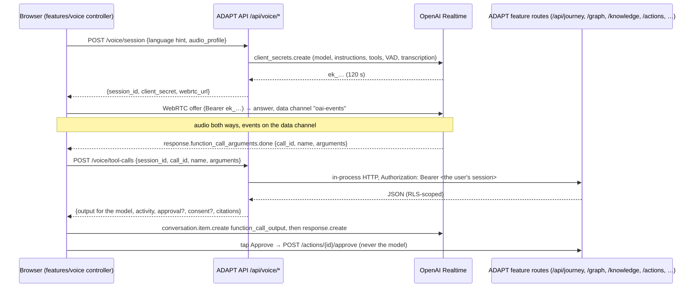

# Voice assistant (W9)

ADAPT's assistant, spoken or typed. In voice, a person talks to ADAPT in any language the
model supports. ADAPT listens, answers aloud, can be interrupted, and works through the
same application tools as the rest of the product: plan, governance graph, official
evidence, documents, research and actions. Consequential steps are prepared and wait for
the person to tap Approve.

When voice isn't available (no OpenAI key, microphone blocked, unsupported browser,
network trouble), the same conversation continues as text, with the same tools.

Code:

* Backend: `backend/app/voice/`, `backend/app/adapters/voice.py`,
  `backend/app/adapters/assistant.py`, `backend/app/contracts/voice.py`.
* Frontend: `frontend/src/features/voice/`, mounted by `features/assistant` (dock, mobile
  sheet, `/assistant` page).
* Tests: `backend/tests/unit/test_voice.py`, `frontend/src/features/voice/voice.test.ts`.

## Flow



## Key decisions

| # | Decision | Why |
|---|---|---|
| V1 | **Ephemeral client secret, minted per connection with a 120 s TTL.** The whole session (model, instructions, tools, turn detection, transcription) is fixed server-side when the secret is created. The browser only uses the secret to open the WebRTC call. | The OpenAI API key never reaches the browser, and a leaked secret is useless within two minutes. Reconnects mint a fresh one. |
| V2 | **Tools call ADAPT's own public API in-process as the user** (`app/voice/gateway.py`: httpx `ASGITransport`, forwarded session token). No tool imports a feature service or touches the database. | The model can do exactly what the person's own session can, no more. Validation, RLS and consent checks of each feature apply unchanged. Voice stays decoupled from workstreams that are still moving. |
| V3 | **A route that isn't in the build means "unavailable", not "not found".** The gateway reads the app's route table (walking FastAPI 0.141's nested `_IncludedRouter`s via `iter_route_contexts`). Each tool lists its current path first and older ones after. | Tools light up as workstreams ship, and the assistant says honestly when something can't be done yet. |
| V4 | **Approvals and consents are taps, never speech.** `prepare_action` only prepares, and the card's Approve/Decline buttons call `/actions/{id}/approve|reject`. Consent cards call `PATCH /me/preferences`. The app then tells the model the backend-confirmed outcome as a system message. | Spoken "yes" can be misheard, overheard or injected. Only the backend's answer counts as what happened. |
| V5 | **Barge-in via server VAD.** `semantic_vad` with `interrupt_response: true`. Over WebRTC the server truncates unplayed audio itself. The client marks the cut-off turn "stopped". Typing over ADAPT does the same: `response.cancel` plus `output_audio_buffer.clear`. Tool calls run only from a **completed** response; calls from an interrupted one get a "not run" output. The client skips its own `response.create` after tool calls when the person's turn has already started a response. | Natural turn-taking, no double answers, and nothing runs that the person talked over. |
| V6 | **No fixed language list.** Transcription has no `language` set. The prompt says to follow the language being spoken, never to infer it from accent, name or nationality, and to offer text when a requested language is weak. The app language is only a hint. | The brief. |
| V7 | **One conversation for voice and text, never stored on the server.** The browser keeps turns in memory. Text turns send recent history to `/voice/assistant`, and a new or restored call re-seeds up to 12 turns as conversation items. | Context survives reconnects and mode switches, with no transcript retention. The user preference `voice_transcripts_retained` defaults to false and nothing writes transcripts. |
| V8 | **Demo mode is a text assistant over the real tools, never fake speech.** Without a key, `/voice/session` returns `mode: "unavailable"` and the UI switches to text. `DemoAssistantModel` maps a request to one tool with keyword rules (building a plan, what-ifs such as "What if I set up in ADGM instead?", starting or checking research, governance questions, documents, actions) and phrases only that tool's real result. A spoken or typed "approve" gets "tap Approve", never an approval. In frontend mock mode (`sources.assistant === "mock"`), typed turns go through the app's mock assistant instead. | Everything around voice can be demonstrated without a key, and nothing presented as an answer is invented. |
| V9 | **Signed session ids; rate limits fail open.** A voice `session_id` is HMAC-signed with the server secret and carries its owner and expiry, so a tool call is verified without storage. Minting (checked before calling OpenAI), tool calls and text turns are rate-limited per user in Redis. If Redis is down, the limits log and allow. | Authorisation never depends on the guard (V2), so a Redis blip shouldn't take voice down, and nothing fails closed. |

## Session configuration

Set in `OpenAIRealtimeProvider.session_config`:

| Setting | Value | Notes |
|---|---|---|
| model | `OPENAI_REALTIME_MODEL` (default `gpt-realtime-2.1`) | `reasoning.effort` = `OPENAI_REALTIME_REASONING_EFFORT` (`low`) for `gpt-realtime-2*` only |
| voice | `OPENAI_REALTIME_VOICE` (`marin`) | |
| turn detection | `semantic_vad`, eagerness `auto`, `create_response` and `interrupt_response` true | waits through "umm" and mid-sentence pauses |
| transcription | `OPENAI_REALTIME_TRANSCRIPTION_MODEL` (`gpt-transcribe`), no language | domain keywords (TAMM, ICP, ADGM, Emirates ID, Tawtheeq, …) are sent to `gpt-transcribe` / `gpt-live-transcribe` only |
| noise reduction | `near_field` or `far_field` from the client's `audio_profile` | headset or phone → near. Updated with `session.update` on `devicechange` |
| tools | the 11 tools below | `tool_choice: auto` |

## Tools

All defined in `app/voice/tools.py`. Output to the model is
`{status, summary?, data?, guidance?}`. `status` is one of `ok`, `not_found`,
`unavailable`, `needs_consent`, `needs_approval`, `invalid_arguments` or `error`, and a
tool never raises, so every call gets an output.

| Tool | Route(s), as the user | Notes |
|---|---|---|
| `get_profile` | `GET /profile`, `GET /me` | adds the faith and community consent states |
| `get_journey` | `GET /journey` (latest), `GET /journey/{id}` | |
| `search_governance` | `GET /graph/governance?q=` | ranks matches (services first), keeps directly linked requirements, cites the evidence behind them |
| `retrieve_evidence` | `GET /knowledge/search?q=&node=&k=` | passages with trust tier, source and freshness. None found → the model must not state the requirement |
| `get_user_graph` | `GET /graph/user/personalisation`, falls back to `/graph/user` | |
| `start_journey` | `POST /journey` | background run. Progress shows in Activity |
| `upload_document_context` | `GET /documents`, `GET /documents/{id}` | asks for an upload by kind. Signed file URLs are dropped and identifiers masked |
| `prepare_action` | `POST /actions/prepare` | against the latest journey (never a what-if copy). Keeps the step's own action type unless `kind` overrides it. Returns an approval card. Simulated adapters carry a visible `DEMO / SIMULATED` label |
| `start_research` | `POST /research` | the research API enforces consent. Its 409 `consent_required` becomes a consent card |
| `simulate_journey` | `POST /journey/{id}/simulate` | waits up to 12 s for the comparison and returns it; on 422, returns `/what-if/variables` so the model can retry with valid keys |
| `get_research_status` | `GET /research?limit=1`, `GET /research/{id}` | results voiced by evidence kind |

**Shaping** (`app/voice/shaping.py`): results are trimmed to a JSON budget. Plumbing is
dropped (`embedding`, `storage_key`, signed `content_url`, …). Identifier-like values
(passport, Emirates ID, document, card and account numbers, IBAN) are masked to their last
three characters. The rule keys on field `name` / `attribute` and never masks UUIDs, so
resource ids still work.

## Frontend

| File | Role |
|---|---|
| `controller.ts` | Singleton that owns the call: microphone, session mint, WebRTC, tool forwarding, reconnect, wake lock, device changes, text turns, approval and consent decisions. Independent of React, so closing the panel never ends a call. |
| `realtime/connection.ts` | One WebRTC call: SDP exchange with the ephemeral key, `oai-events` data channel, 15 s connect timeout (data channel open and `session.created`), 5 s grace for ICE `disconnected`, microphone swap with `replaceTrack`. |
| `conversation.ts` | Pure reducer (unit tested): turns keyed by Realtime item ids (so a late transcript still lands before the reply), barge-in, tools, approvals, consents, notices, and `derivePhase`. |
| `orchestration.ts` | `ToolTurn` (when to send `response.create`), reconnect backoff (1, 2, 4, 8, 15 s with jitter, 5 attempts), audio profile heuristic. |
| `ConversationPanel.tsx` | The UI, container-agnostic. `variant: "dock" \| "sheet" \| "page"`. |
| `selectors.ts` | `selectIsLive`, `selectRunningTool`, `selectCitations`, `selectActions`, `selectPendingApprovals`. List selectors are memoised on the items array, so they're safe in `useVoiceStore(selector)`. |
| `mockBridge.ts` | Frontend mock mode for typed turns and approvals. |

**States shown:** the connection pill (Live, Connecting, Reconnecting, Offline, Ended, Not
connected, Text chat) and the orb/caption phase (listening, you're speaking, thinking,
running a named tool, speaking with "just talk to interrupt", muted, reconnecting,
offline). The orb's rings follow live microphone and output levels, which are written to
CSS variables on animation frames rather than React state. With reduced motion they're
static.

**Mobile:**

* Microphone failures each get their own message and a way forward: denied, missing, in
  use, insecure context (voice needs https, including on a LAN IP), unsupported browser.
  All of them fall back to text.
* The screen wake lock is held during a call and re-acquired when the page is shown
  again. A "Keep ADAPT open" hint appears where wake lock isn't supported.
* Lock-screen media controls (pause = mute, stop = end).
* When the page becomes visible again, the call is health-checked, and a microphone
  track that ended (iOS lock screen, unplugged headset) is re-acquired and swapped in.
* Offline waits for the `online` event, then reconnects and restores context.

**Errors:** an approval already decided elsewhere (409 `approval_not_pending`) is re-read with `GET /actions/{id}` and shown in its real state. `/voice/session` failures map to `session_expired` (401),
`rate_limited` (429 / `voice_busy`), `connect_timeout` and `connect_failed`. A failed tool
call still returns an output to the model, so a call is never left hanging. Harmless
Realtime protocol races (`conversation_already_has_active_response`, …) are ignored.

## Endpoints

| Route | Body → response |
|---|---|
| `POST /api/voice/session` | `VoiceSessionRequest {language?, journey_id?, audio_profile, resumed}` → `VoiceSessionOut {mode, session_id, client_secret, expires_at, model, voice, webrtc_url, tools[], unavailable_reason}` |
| `POST /api/voice/tool-calls` | `VoiceToolCallRequest {session_id, call_id, name, arguments}` → `VoiceToolCallResult {status, output, activity, approval?, consent?, citations[], ui_hint?}` |
| `POST /api/voice/assistant` | `AssistantMessageRequest {messages[≤40], language?, journey_id?}` → `AssistantMessageOut {mode: live\|demo, reply, tool_results[]}` |

Limits: 10 sessions per minute; 300 tool calls per session and 60 per minute; 20 text
turns per minute. The text loop is capped at 4 tool rounds.

## Testing

```bash
cd backend && uv run pytest tests/unit/test_voice.py   # 40 tests, no services needed
npm test -- src/features/voice                          # 23 tests
```

The backend tests mount the real voice router and auth next to stand-ins shaped like each
feature's published contract. Tools reach them in-process exactly as in production.
Covered: Bearer forwarding, session binding, unshipped routes, argument errors, masking,
citations, approval and consent cards, the what-if retry and both text-assistant modes.

**Verified end to end** against a freshly migrated and seeded throwaway database, with
the real app and an ARQ worker on an isolated queue:
* Governance search: ranked, with 6 source citations.
* Official evidence retrieval, profile, documents, user graph, and research start and
  status.
* The whole action path: `start_journey` → the journey agent built a 23-step plan →
  `prepare_action(task_key)` → approval card (official DoH link) → Approve →
  `handoff_required` "ADAPT did not submit anything" → a repeat Approve got 409
  `approval_not_pending` and was reconciled via `GET /actions/{id}`.

The panel was driven in headless Chrome at 390 and 1440 px: text mode, an Arabic voice
turn (RTL), a running tool, an approval card, speaking and barge-in, and the `/assistant`
side column fed by the selectors. An independent code review's 16 findings are fixed.
Among them: tools run only from completed responses, typed interruption, signed session
ids, path-segment validation on id arguments, and a text-only final round in the text
loop.

**Not yet verified live:** a real WebRTC call. There was no OpenAI key in the development
environment. To try it, set `OPENAI_API_KEY`, open the assistant over `http://localhost`
or https (microphones need a secure context), and tap the orb.

## Known limits and next steps

* **Server-side tool execution:** tool calls currently travel through the browser (V2
  keeps them safe). The upgrade path is a sideband server connection to the call
  (`call_id` from the SDP answer's `Location`), so tools run without a browser round trip.
* **Journey-run approvals:** gates raised by a background journey run appear in
  Activity/Journey. The voice UI points there and doesn't resolve them itself.
* **Frontend auto mode:** while journeys are mocked in the frontend, typed turns use the
  frontend mock assistant, to stay consistent with the plan the UI shows. Live voice
  always uses the backend tools.
* **Copy is English.** Transcripts follow the speaker's script (`dir="auto"`). The
  message catalogue is W12.
